Predict customer product preferences
================
Vera Giulia Sala - Ubiqum Code Academy

------------------------------------------------------------------------

Goal of the analysis
====================

------------------------------------------------------------------------

The sales team of Blackwell Electronics engaged a market research firm to conduct a survey of existing customers. The main objective of the survey is to find out which of the two brands of computers customers prefer among Acer and Sony. Together with the brand preference of the users, the survey collects answers to several demografic questions (age, salary, car, etc.).
For a certain amount of respondents the brand preference question was not recorded, so the idea of the sale team is to try to predict it starting from the responses to the demografic questions.

------------------------------------------------------------------------

Dataset
=======

------------------------------------------------------------------------

The dataset includes 10,000 fully-answered surveys and 5,000 incomplete surveys (with brand preference missing), answering the following questions:

1.  What is your yearly salary, not including bonuses?
    Respondents enter numeric value

2.  What is your age?
    Respondents enter numeric value

3.  What is the highest level of education you have obtained?
    Respondents select from the following 5 choices:
    Value Description
    0 Less than High School Degree
    1 High School Degree
    2 Some College
    3 4-Year College Degree
    4 Master's, Doctoral or Professional Degree

4.  What is the make of your primary car?
    Respondents select from the following 20 choices:
    Value Description
    1 BMW
    2 Buick
    3 Cadillac
    4 Chevrolet
    5 Chrysler
    6 Dodge
    7 Ford
    8 Honda
    9 Hyundai
    10 Jeep
    11 Kia
    12 Lincoln
    13 Mazda
    14 Mercedes Benz
    15 Mitsubishi
    16 Nissan
    17 Ram
    18 Subaru
    19 Toyota
    20 None of the above

5.  What is your zip code?
    Respondents enter zip code, which is captured as 1 of the following 9 regions in the U.S.
    Value Region
    0 New England
    1 Mid-Atlantic
    2 East North Central
    3 West North Central
    4 South Atlantic
    5 East South Central
    6 West South Central
    7 Mountain
    8 Pacific

6.  What amount of credit is available to you?
    Respondents enter numeric value

7.  Which brand of computers do you prefer?
    Respondents select from the following 2 choices:
    Value Description
    0 Acer
    1 Sony

------------------------------------------------------------------------

Preprocessing, exploratory analysis of data
===========================================

------------------------------------------------------------------------

We perform a first exploration of the fully-answered survey dataset. We check the data quality (no missing values, no repeated rows) and we visualize the distribution of the interviewed users along the different variables. The exploratory analysis gives us the following insights:

> 62% of the interviewed customers prefer Sony, while 38% prefer Acer.

> The distribution of the interviewed users along the demografic variables is flat for all the variables: it means that the survey has been performed with a stratified sample. This choice allows analyzing with good accuracy all users segments.

> From the exploratory analysis, it seems that only the variable "salary" has a correlation with the brand preference.

``` r
library(readxl)
library(reshape2)
library(ggplot2)
library(arules)
library(caret)
library(rpart.plot)
```

``` r
dati <- read_excel("Survey_Key_and_Complete_Responses_excel.xlsx",sheet =2)
```

``` r
str(dati)
```

    ## Classes 'tbl_df', 'tbl' and 'data.frame':    10000 obs. of  7 variables:
    ##  $ salary : num  119807 106880 78021 63690 50874 ...
    ##  $ age    : num  45 63 23 51 20 56 24 62 29 41 ...
    ##  $ elevel : num  0 1 0 3 3 3 4 3 4 1 ...
    ##  $ car    : num  14 11 15 6 14 14 8 3 17 5 ...
    ##  $ zipcode: num  4 6 2 5 4 3 5 0 0 4 ...
    ##  $ credit : num  442038 45007 48795 40889 352951 ...
    ##  $ brand  : num  0 1 0 1 0 1 1 1 0 1 ...

``` r
print(paste("The number of NAs is ", (sum(is.na(dati)))))
```

    ## [1] "The number of NAs is  0"

``` r
print(paste("The number of duplicated rows is ",sum(duplicated(dati))))
```

    ## [1] "The number of duplicated rows is  0"

``` r
perc1 <- round(table(dati$brand)[1]/sum(table(dati$brand))*100,0)
perc2 <- round(table(dati$brand)[2]/sum(table(dati$brand))*100,0)

ggplot(dati,aes(x=as.factor(brand),fill=as.factor(brand)))+geom_bar()+xlab("Brand")+
scale_fill_discrete(name="brand",labels = c("Acer", "Sony"))+
geom_text(aes(1, 3000, label=paste(perc1,"%")))+
geom_text(aes(2, 5000, label=paste(perc2,"%")))+
scale_x_discrete(labels=c("0" = "Acer","1" = "Sony"))+
ggtitle("Survey brand preferences")+ theme(plot.title = element_text(hjust = 0.5))
```

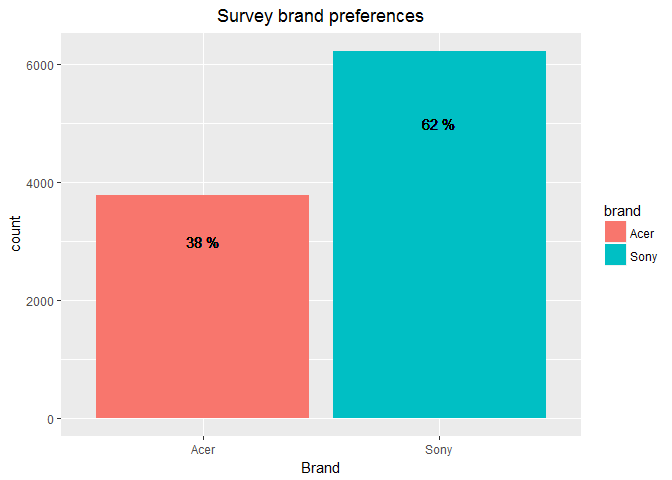

``` r
aaa <- melt(dati,id.vars = c("brand"))
ggplot(aaa,aes(x=value,fill=as.factor(brand)))+geom_histogram(col="gray")+facet_wrap(~ variable,scales = "free")+
scale_fill_discrete(name="brand",labels = c("Acer", "Sony"))+
ggtitle("Distribution of the interviewed users, divided by brand preference")+ theme(plot.title = element_text(hjust = 0.5))
```

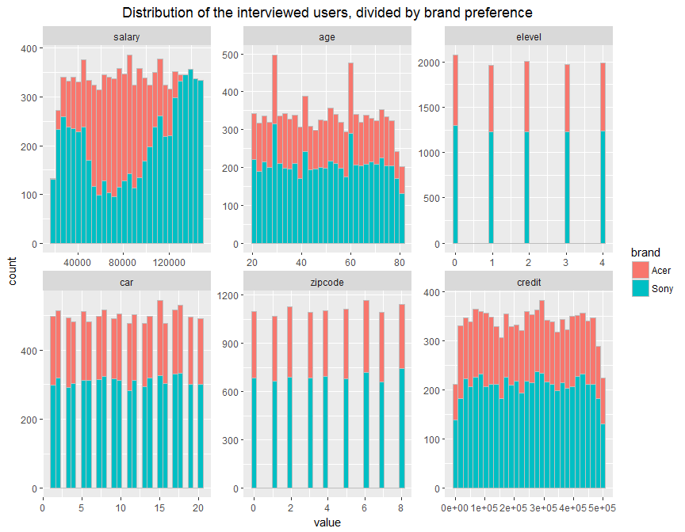

We convert "car", "zipcode", "brand" to categorical variables.

``` r
datip <- dati
datip$zipcode <- as.factor(datip$zipcode)
datip$brand <- as.factor(datip$brand)
datip$car <- as.factor(datip$car)
```

------------------------------------------------------------------------

Brand preference prediction
===========================

------------------------------------------------------------------------

We try to predict the brand preference starting from the answers to the demografic questions. We define a train (75%) and test (25%) set, stratified on the brand preference variable. From the train set we extract a smaller stratified sample (3002 instances), that we use to train different models.

``` r
set.seed(123)
indexT <- createDataPartition(datip$brand, p = .75, list = FALSE)
train <- datip[indexT,]
test <- datip[-indexT,]
print(paste("# instances in train set: ",dim(train)[1]))
```

    ## [1] "# instances in train set:  7501"

``` r
print(paste("# instances in test set: ",dim(test)[1]))
```

    ## [1] "# instances in test set:  2499"

``` r
iii <- createDataPartition(train$brand, p = .40, list = FALSE)
tt <- train[iii,]
print(paste("# instances in subset of train set: ",dim(tt)[1]))
```

    ## [1] "# instances in subset of train set:  3002"

------------------------------------------------------------------------

Feature selection with random forest
------------------------------------

------------------------------------------------------------------------

We use 3-fold cross validation (repeated x3) to train a random forest model and determine which features are more relevant for brand preference predicition.

> There are two main relavant features for brand preference prediction: "salary" and "age"

``` r
set.seed(123)
fitControl <- trainControl(method = "repeatedcv", number = 3, repeats = 3)
fitrf <- train(brand ~ .  , data = tt, method = "rf",  tuneLength = 5, trControl=fitControl)
```

``` r
print(fitrf)
```

    ## Random Forest 
    ## 
    ## 3002 samples
    ##    6 predictor
    ##    2 classes: '0', '1' 
    ## 
    ## No pre-processing
    ## Resampling: Cross-Validated (3 fold, repeated 3 times) 
    ## Summary of sample sizes: 2001, 2001, 2002, 2001, 2001, 2002, ... 
    ## Resampling results across tuning parameters:
    ## 
    ##   mtry  Accuracy   Kappa     
    ##    2    0.6306906  0.03258392
    ##    9    0.9025094  0.79318742
    ##   16    0.9097284  0.80795881
    ##   23    0.9102834  0.80894809
    ##   31    0.9101723  0.80874083
    ## 
    ## Accuracy was used to select the optimal model using  the largest value.
    ## The final value used for the model was mtry = 23.

``` r
varImpPlot(fitrf$finalModel,type=2, main="Variables Importance")
```

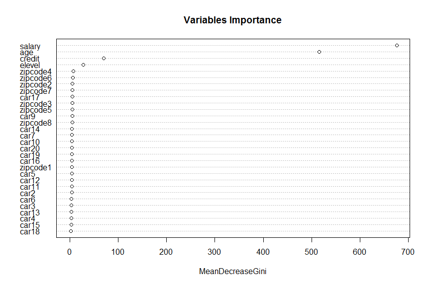

``` r
ggplot(tt, aes(x=salary, y=age))+geom_point(aes(col=brand),size=2, shape=15)+
scale_color_manual(labels=c("0"="Acer","1"="Sony"), values = c( "#545454","#bdbdbd"))+ggtitle("Training data")+ theme(plot.title = element_text(hjust = 0.5))
```

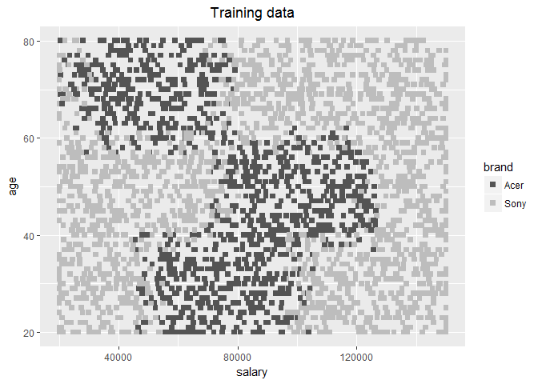

> We see a clear separation of the brand preference in the salary - age space of variables.

------------------------------------------------------------------------

Brand preference classification with different models: study of the classification boundaries
---------------------------------------------------------------------------------------------

------------------------------------------------------------------------

We use 3-fold cross validation (repeated x3) on the same train subsample used before to train different models with just two predictors (salary and age). For each model we plot the predicted classification boundaries and the training data on top of it.

``` r
set.seed(123)
fitControl <- trainControl(method = "repeatedcv", number = 3, repeats = 3)
fitrf2 <- train(brand ~ salary + age  , data = tt, method = "rf",  tuneLength = 5, trControl=fitControl)
```

    ## note: only 1 unique complexity parameters in default grid. Truncating the grid to 1 .

``` r
print(fitrf2)
```

    ## Random Forest 
    ## 
    ## 3002 samples
    ##    2 predictor
    ##    2 classes: '0', '1' 
    ## 
    ## No pre-processing
    ## Resampling: Cross-Validated (3 fold, repeated 3 times) 
    ## Summary of sample sizes: 2001, 2001, 2002, 2001, 2001, 2002, ... 
    ## Resampling results:
    ## 
    ##   Accuracy   Kappa    
    ##   0.8998449  0.7869627
    ## 
    ## Tuning parameter 'mtry' was held constant at a value of 2

``` r
grid <- expand.grid(x=seq(0,160000,1000), y=0:100)
names(grid) <- c("salary","age")
pred_frid <- predict(fitrf2,grid)
grid$pred <- pred_frid
```

``` r
ggplot(grid, aes(salary, age)) + geom_tile(aes(fill = pred)) +
  xlab("Salary") + ylab("Age") +
geom_point(data=tt,aes(x=salary,y=age,col=brand),size=1)+
scale_color_manual(values = c("red", "blue"),name="Brand",labels=c("0"="Acer","1"="Sony"))+
scale_fill_discrete(name="Brand predictions",labels=c("0"="Acer","1"="Sony"))+ ggtitle("Random forest classification boundaries")+ theme(plot.title = element_text(hjust = 0.5))
```

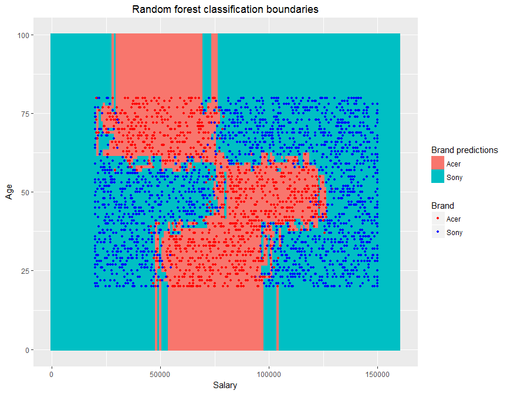

``` r
set.seed(123)
fitControl <- trainControl(method = "repeatedcv", number = 3, repeats = 3)
fitknn2 <- train(brand ~ salary + age  , data = tt, method = "knn",  tuneLength = 8, trControl=fitControl)
print(fitknn2)
```

    ## k-Nearest Neighbors 
    ## 
    ## 3002 samples
    ##    2 predictor
    ##    2 classes: '0', '1' 
    ## 
    ## No pre-processing
    ## Resampling: Cross-Validated (3 fold, repeated 3 times) 
    ## Summary of sample sizes: 2001, 2001, 2002, 2001, 2001, 2002, ... 
    ## Resampling results across tuning parameters:
    ## 
    ##   k   Accuracy   Kappa    
    ##    5  0.6888745  0.3371538
    ##    7  0.6962016  0.3522691
    ##    9  0.6970904  0.3527956
    ##   11  0.7029747  0.3636785
    ##   13  0.7070844  0.3715287
    ##   15  0.7117488  0.3819808
    ##   17  0.7128588  0.3842175
    ##   19  0.7156326  0.3907838
    ## 
    ## Accuracy was used to select the optimal model using  the largest value.
    ## The final value used for the model was k = 19.

``` r
grid <- expand.grid(x=seq(0,160000,1000), y=0:100)
names(grid) <- c("salary","age")
pred_frid <- predict(fitknn2,grid)
grid$pred <- pred_frid
```

``` r
ggplot(grid, aes(salary, age)) + geom_tile(aes(fill = pred)) +
  xlab("Salary") + ylab("Age") +
geom_point(data=tt,aes(x=salary,y=age,col=brand),size=1)+
scale_color_manual(values = c("red", "blue"),name="Brand",labels=c("0"="Acer","1"="Sony"))+
scale_fill_discrete(name="Brand predictions",labels=c("0"="Acer","1"="Sony"))+ ggtitle("k-nn classification boundaries: no-scaled data")+ theme(plot.title = element_text(hjust = 0.5))
```

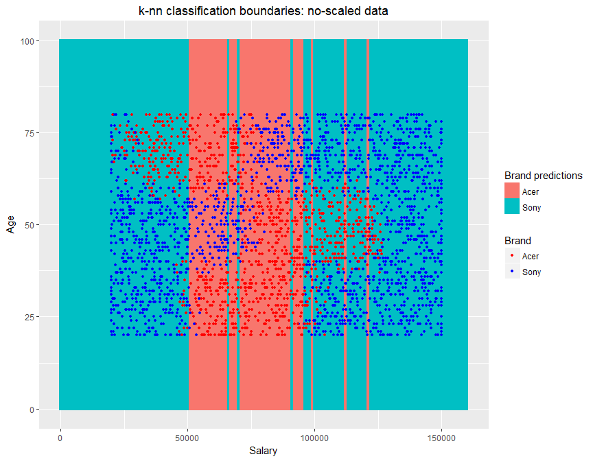

``` r
set.seed(123)
fitControl <- trainControl(method = "repeatedcv", number = 3, repeats = 3)
fitknn3 <- train(brand ~ salary + age  , data = tt, method = "knn",preProcess=c("scale","center") , tuneLength = 8, trControl=fitControl)
print(fitknn3)
```

    ## k-Nearest Neighbors 
    ## 
    ## 3002 samples
    ##    2 predictor
    ##    2 classes: '0', '1' 
    ## 
    ## Pre-processing: scaled (2), centered (2) 
    ## Resampling: Cross-Validated (3 fold, repeated 3 times) 
    ## Summary of sample sizes: 2001, 2001, 2002, 2001, 2001, 2002, ... 
    ## Resampling results across tuning parameters:
    ## 
    ##   k   Accuracy   Kappa    
    ##    5  0.9069513  0.8022900
    ##    7  0.9069519  0.8026980
    ##    9  0.9100598  0.8093065
    ##   11  0.9108381  0.8109251
    ##   13  0.9128361  0.8149851
    ##   15  0.9131698  0.8159000
    ##   17  0.9142793  0.8182816
    ##   19  0.9138353  0.8173979
    ## 
    ## Accuracy was used to select the optimal model using  the largest value.
    ## The final value used for the model was k = 17.

``` r
grid <- expand.grid(x=seq(0,160000,1000), y=0:100)
names(grid) <- c("salary","age")
pred_frid <- predict(fitknn3,grid)
grid$pred <- pred_frid
```

``` r
ggplot(grid, aes(salary, age)) + geom_tile(aes(fill = pred)) +
  xlab("Salary") + ylab("Age") +
geom_point(data=tt,aes(x=salary,y=age,col=brand),size=1)+
scale_color_manual(values = c("red", "blue"),name="Brand",labels=c("0"="Acer","1"="Sony"))+
scale_fill_discrete(name="Brand predictions",labels=c("0"="Acer","1"="Sony"))+ ggtitle("k-nn classification boundaries: scaled data")+ theme(plot.title = element_text(hjust = 0.5))
```

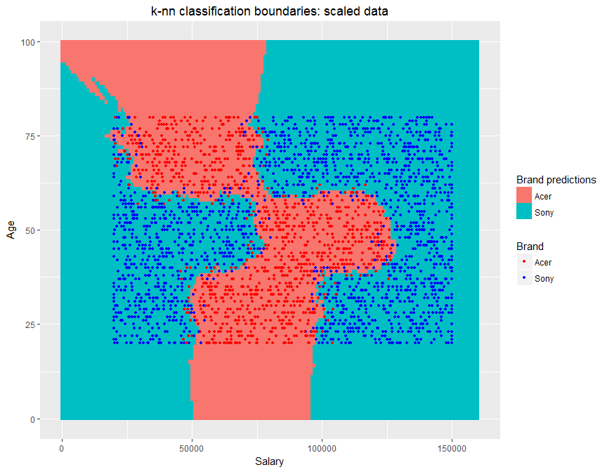

``` r
set.seed(123)
fitControl <- trainControl(method = "repeatedcv", number = 3, repeats = 3)
fitsvm2 <- train(brand ~ salary + age  , data = tt, method = "svmRadial" , tuneLength = 8, trControl=fitControl)
print(fitsvm2)
```

    ## Support Vector Machines with Radial Basis Function Kernel 
    ## 
    ## 3002 samples
    ##    2 predictor
    ##    2 classes: '0', '1' 
    ## 
    ## No pre-processing
    ## Resampling: Cross-Validated (3 fold, repeated 3 times) 
    ## Summary of sample sizes: 2001, 2001, 2002, 2001, 2001, 2002, ... 
    ## Resampling results across tuning parameters:
    ## 
    ##   C      Accuracy   Kappa    
    ##    0.25  0.9100594  0.8097964
    ##    0.50  0.9128349  0.8152250
    ##    1.00  0.9142785  0.8179421
    ##    2.00  0.9163888  0.8224507
    ##    4.00  0.9167219  0.8231661
    ##    8.00  0.9172781  0.8244283
    ##   16.00  0.9176109  0.8252479
    ##   32.00  0.9177224  0.8254180
    ## 
    ## Tuning parameter 'sigma' was held constant at a value of 1.157604
    ## Accuracy was used to select the optimal model using  the largest value.
    ## The final values used for the model were sigma = 1.157604 and C = 32.

``` r
grid <- expand.grid(x=seq(0,160000,1000), y=0:100)
names(grid) <- c("salary","age")
pred_frid <- predict(fitsvm2,grid)
grid$pred <- pred_frid
```

``` r
ggplot(grid, aes(salary, age)) + geom_tile(aes(fill = pred)) +
  xlab("Salary") + ylab("Age") +
geom_point(data=tt,aes(x=salary,y=age,col=brand),size=1)+
scale_color_manual(values = c("red", "blue"),name="Brand",labels=c("0"="Acer","1"="Sony"))+
scale_fill_discrete(name="Brand predictions",labels=c("0"="Acer","1"="Sony"))+ ggtitle("SVM classification boundaries")+ theme(plot.title = element_text(hjust = 0.5))
```

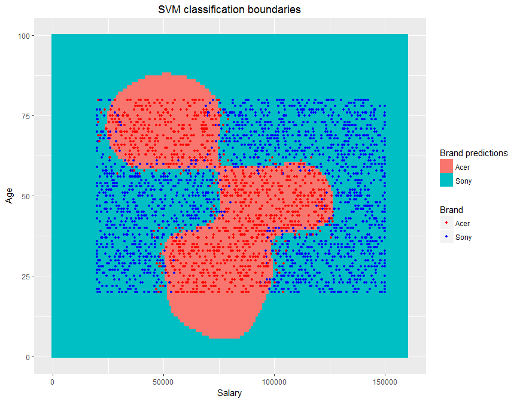

``` r
set.seed(123)
fitControl <- trainControl(method = "repeatedcv", number = 3, repeats = 3)
fitC50 <- train(brand ~ salary + age  , data = tt, method = "C5.0" , tuneLength = 8, trControl=fitControl)
print(fitC50)
```

    ## C5.0 
    ## 
    ## 3002 samples
    ##    2 predictor
    ##    2 classes: '0', '1' 
    ## 
    ## No pre-processing
    ## Resampling: Cross-Validated (3 fold, repeated 3 times) 
    ## Summary of sample sizes: 2001, 2001, 2002, 2001, 2001, 2002, ... 
    ## Resampling results across tuning parameters:
    ## 
    ##   model  winnow  trials  Accuracy   Kappa    
    ##   rules  FALSE    1      0.8668661  0.7270957
    ##   rules  FALSE   10      0.9049538  0.7967123
    ##   rules  FALSE   20      0.9067298  0.8018929
    ##   rules  FALSE   30      0.9067298  0.8018929
    ##   rules  FALSE   40      0.9067298  0.8018929
    ##   rules  FALSE   50      0.9067298  0.8018929
    ##   rules  FALSE   60      0.9067298  0.8018929
    ##   rules  FALSE   70      0.9067298  0.8018929
    ##   rules   TRUE    1      0.8668661  0.7270957
    ##   rules   TRUE   10      0.9049538  0.7967123
    ##   rules   TRUE   20      0.9067298  0.8018929
    ##   rules   TRUE   30      0.9067298  0.8018929
    ##   rules   TRUE   40      0.9067298  0.8018929
    ##   rules   TRUE   50      0.9067298  0.8018929
    ##   rules   TRUE   60      0.9067298  0.8018929
    ##   rules   TRUE   70      0.9067298  0.8018929
    ##   tree   FALSE    1      0.8671996  0.7279836
    ##   tree   FALSE   10      0.9057303  0.8003489
    ##   tree   FALSE   20      0.9042873  0.7977602
    ##   tree   FALSE   30      0.9042873  0.7977602
    ##   tree   FALSE   40      0.9042873  0.7977602
    ##   tree   FALSE   50      0.9042873  0.7977602
    ##   tree   FALSE   60      0.9042873  0.7977602
    ##   tree   FALSE   70      0.9042873  0.7977602
    ##   tree    TRUE    1      0.8671996  0.7279836
    ##   tree    TRUE   10      0.9057303  0.8003489
    ##   tree    TRUE   20      0.9042873  0.7977602
    ##   tree    TRUE   30      0.9042873  0.7977602
    ##   tree    TRUE   40      0.9042873  0.7977602
    ##   tree    TRUE   50      0.9042873  0.7977602
    ##   tree    TRUE   60      0.9042873  0.7977602
    ##   tree    TRUE   70      0.9042873  0.7977602
    ## 
    ## Accuracy was used to select the optimal model using  the largest value.
    ## The final values used for the model were trials = 20, model = rules
    ##  and winnow = TRUE.

``` r
grid <- expand.grid(x=seq(0,160000,1000), y=0:100)
names(grid) <- c("salary","age")
pred_frid <- predict(fitC50,grid)
grid$pred <- pred_frid
```

``` r
ggplot(grid, aes(salary, age)) + geom_tile(aes(fill = pred)) +
  xlab("Salary") + ylab("Age") +
geom_point(data=tt,aes(x=salary,y=age,col=brand),size=1)+
scale_color_manual(values = c("red", "blue"),name="Brand",labels=c("0"="Acer","1"="Sony"))+
scale_fill_discrete(name="Brand predictions",labels=c("0"="Acer","1"="Sony"))+ ggtitle("C5.0 classification boundaries")+ theme(plot.title = element_text(hjust = 0.5))
```

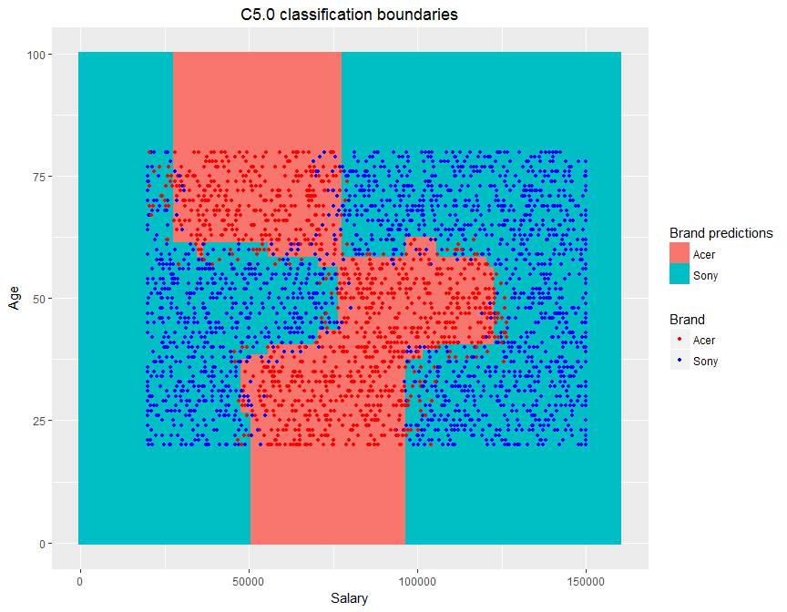

> All the classification models we used are able to predict the brand preference with a quite good accuracy (~ 0.9). We see that the accuracy of prediction is 100% away from the classification boundaries. At the boundaries the two classes are mixed so no model can predict correctly.

> The classification boundary plots give us insights on how the different models operate to build the classification boundary.

> The best performing model is the SVM, with an accuracy ~ 0.92.

------------------------------------------------------------------------

Brand preference classification with full dataset
-------------------------------------------------

------------------------------------------------------------------------

We use the SMV model trained on the full training set to make predictions on the test set.

> The chosen model can classify the "brand preference" on the test set with an accuracy of 92%.

``` r
set.seed(123)
fitControl <- trainControl(method = "none")
fit_tot <- train(brand ~ salary + age  , data = train, method = "svmRadial" , tuneLength = 1, tuneGrid=expand.grid(.sigma = 1.157604, .C = 32), trControl=fitControl)
print(fit_tot)
```

    ## Support Vector Machines with Radial Basis Function Kernel 
    ## 
    ## 7501 samples
    ##    2 predictor
    ##    2 classes: '0', '1' 
    ## 
    ## No pre-processing
    ## Resampling: None

``` r
predictions <- predict(fit_tot, test)
```

``` r
postResample(predictions, test$brand)
```

    ##  Accuracy     Kappa 
    ## 0.9243697 0.8387545

``` r
grid <- expand.grid(x=seq(0,160000,1000), y=0:100)
names(grid) <- c("salary","age")
pred_frid <- predict(fit_tot,grid)
grid$pred <- pred_frid
```

``` r
ggplot(grid, aes(salary, age)) + geom_tile(aes(fill = pred)) +
  xlab("Salary") + ylab("Age") +
geom_point(data=test,aes(x=salary,y=age,col=brand),size=1)+
scale_color_manual(values = c("red", "blue"),name="Brand",labels=c("0"="Acer","1"="Sony"))+
scale_fill_discrete(name="Brand predictions",labels=c("0"="Acer","1"="Sony"))+ ggtitle("Test set, SVM classification boundaries")+ theme(plot.title = element_text(hjust = 0.5))
```

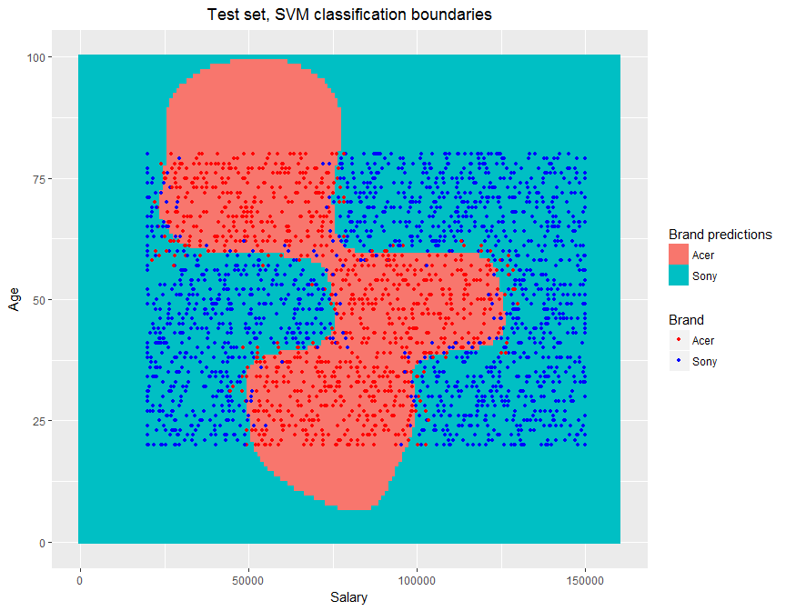

------------------------------------------------------------------------

Brand preference predictions for the incomplete surveys
=======================================================

------------------------------------------------------------------------

We use the trained model to predict the brand preferences of the 5,000 incomplete surveys. Note that the distribution of interviewed users along the demografic variables and the distribution of data points in the "salary" - "age" space is very similar to what we found for the fully-answered surveys. So we can safely predict on the new dataset. Just the first 20 predictions are shown below.

``` r
dati_new <- read.csv("SurveyIncomplete.csv")
```

``` r
bbb <- melt(dati_new[(names(dati_new) != "brand")])
ggplot(bbb,aes(x=value))+geom_histogram(col="gray")+facet_wrap(~ variable,scales = "free")+
ggtitle("Distributions of the interviewed users for the incomplete surveys")+ theme(plot.title = element_text(hjust = 0.5))
```

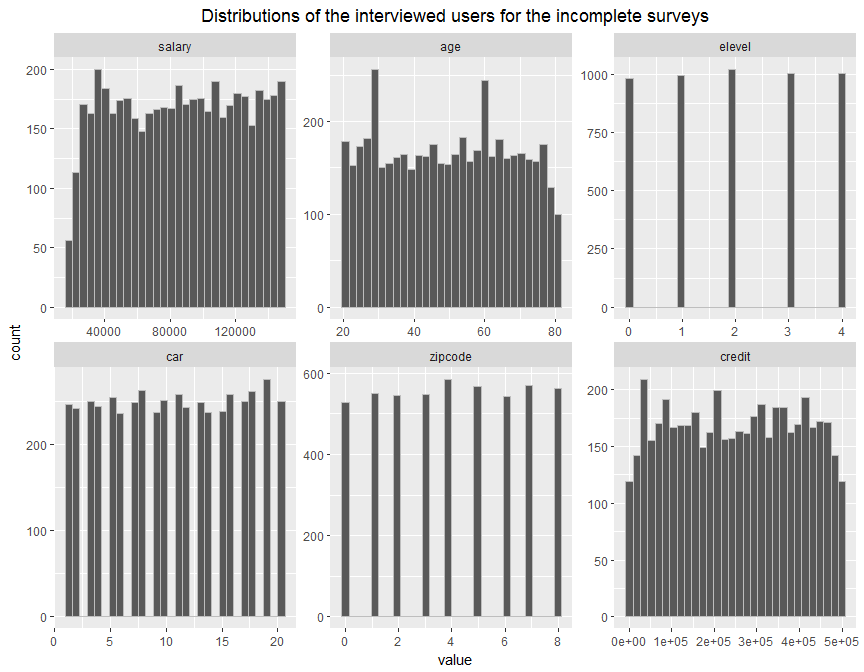

``` r
grid <- expand.grid(x=seq(0,160000,1000), y=0:100)
names(grid) <- c("salary","age")
pred_frid <- predict(fit_tot,grid)
grid$pred <- pred_frid
```

``` r
ggplot(grid, aes(salary, age)) + geom_tile(aes(fill = pred)) +
  xlab("Salary") + ylab("Age") +
scale_fill_discrete(name="Brand predictions",labels=c("0"="Acer","1"="Sony"))+
geom_point(data=dati_new,aes(x=salary,y=age),size=1, shape = 4)+ggtitle("Incomplete surveys")+
theme(plot.title = element_text(hjust = 0.5))
```

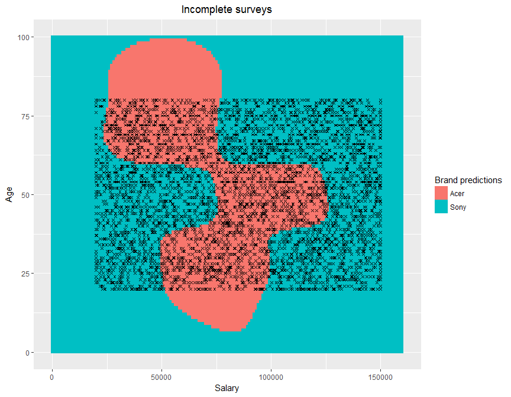

``` r
#geom_point(data=tt,aes(x=salary,y=age,col=brand),size=1)+
#scale_color_manual(values = c("red", "blue"),name="Brand",labels=c("0"="Acer","1"="Sony"))+
```

``` r
brand_pred <- predict(fit_tot, dati_new)
```

``` r
dati_new$brand <- brand_pred
```

``` r
head(dati_new,20)
```

    ##       salary age elevel car zipcode    credit brand
    ## 1  110499.74  54      3  15       4 354724.18     0
    ## 2  140893.78  44      4  20       7 395015.34     1
    ## 3  119159.65  49      2   1       3 122025.09     0
    ## 4   20000.00  56      0   9       1  99629.62     1
    ## 5   93956.32  59      1  15       1 458679.83     0
    ## 6   41365.43  71      2   7       2 216839.72     0
    ## 7   94805.61  32      1  17       1 233216.07     0
    ## 8   34410.63  33      4  17       0 450707.38     1
    ## 9  128298.82  32      1  19       2  20768.06     1
    ## 10 100806.92  58      2   8       4 293106.65     0
    ## 11  49863.41  22      1  12       1 156086.69     1
    ## 12  94554.19  47      4  12       2 100467.99     0
    ## 13  79637.66  41      2   1       3 387564.55     0
    ## 14  87085.58  40      4   9       2 458378.00     0
    ## 15 126945.67  62      3   4       4 211178.90     1
    ## 16  29080.92  58      1  13       3  29965.98     1
    ## 17 147561.73  28      4   6       8 322196.31     1
    ## 18  72346.05  37      3  15       8 403166.45     0
    ## 19  52129.77  44      3   9       6  73639.46     1
    ## 20  35640.04  57      3  10       8  91722.42     1

------------------------------------------------------------------------

Conclusions
===========

------------------------------------------------------------------------

**Overall customers brand preference**

> Among the interviewed customers the brand preferences are: 62% prefer Sony, 38% prefer Acer.

> Nevertheless we should consider that these pecentages relate to the stratified sample that has been chosen for conducting the survey, and therefore are not representative of the overall brand preference of customers. To determine the overall brand preference we should cross our study with the customers population distribution.

**Brand preference prediction**

> We were able to predict the brand preference of customers starting from the answers to the demografic questions with a high accuracy ( ~ 92%).

> This information doesn't give more insight in determining the overall customers brand preference, but can be used to target new customers that didn't participate to the survey.

> Our analysis showed that just two demografic data ("salary" and "age") are sufficient for defining the customer brand preference. This information could be used to simplify the survey, making all the process less demanding and more efficient for the customers and the company.
