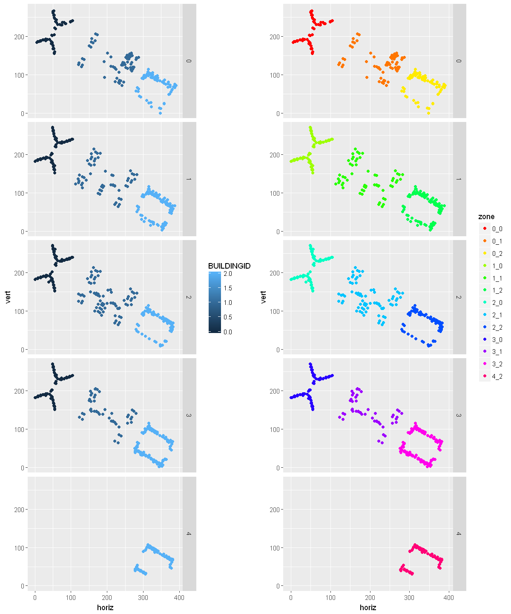
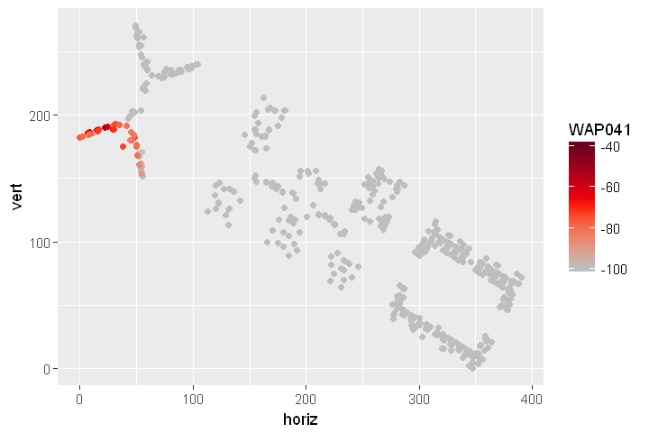
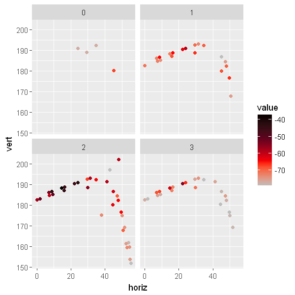
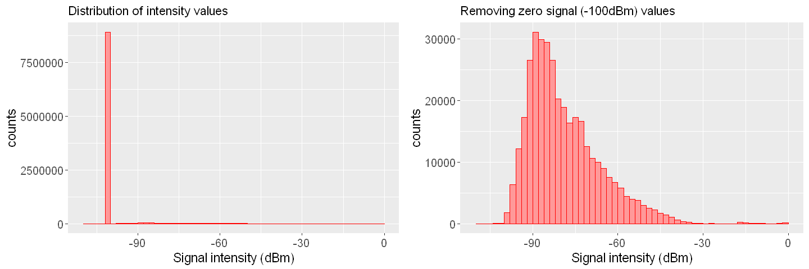
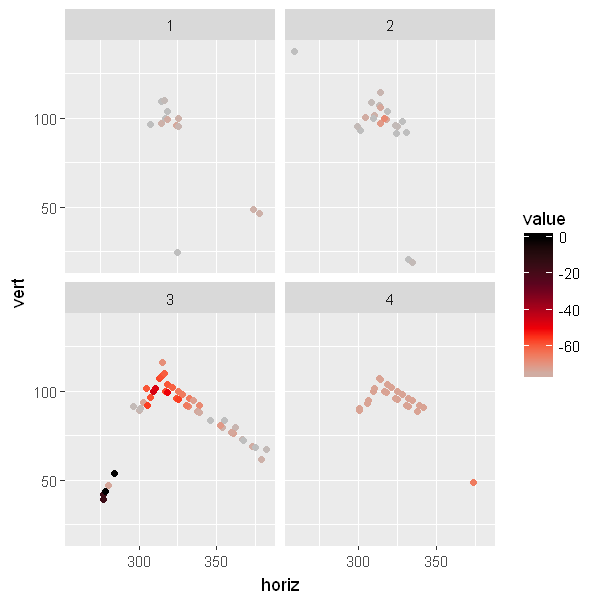
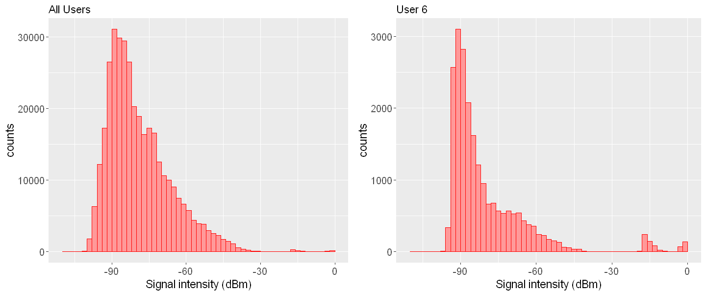

<h1> <big> Indoor Locationing by wifi fingerprinting </big> </h1> 
<h3> Vera Giulia Sala - Ubiqum Code Academy </h3>

<ol> 
  <li><a href="#p1"> Goal of the analysis</a></li> 
  <li><a href="#p2">Dataset</a></li> 
  <li><a href="#p4">Preprocessing and explorative analysis of data</a></li> 
      <ol>   <li> <a href="#p4_1">First exploration of data and feature redefinition</a> </li> 
             <li> <a href="#p4_2">Data visualization</a> </li>
             <li> <a href="#p4_3">Removing outliers</a> </li>
             <li> <a href="#p4_4">4 Preprocessing strategies</a> </li></ol>
  <li><a href="#p5">Location prediction: zone (classification)</a></li> 
  <li><a href="#p6">Location prediction: coordinates (regression)</a></li> 
  <li><a href="#p7">Conclusion</a></li> 
</ol>

# <a id="p1">Goal of the analysis</a> 

The goal of the analysis is to use "wifi fingerprinting" to determine a person's location in indoor spaces. While GPS works fairly reliably outdoors, it generally doesn't work indoors, so wifi fingerprinting appears as a good alternative candidate. Wifi fingerprinting uses the signals from multiple wifi hotspots within the building to determine location, analogously to how GPS uses satellite signals. This technique could be deployed on large industrial campuses, in shopping malls, et cetera to help people to navigate a complex, unfamiliar interior space without getting lost. 

To validate the wifi fingerprint technique, we use multiple machine learning models on a large database of wifi fingerprints for a multi-building university campus with a location (building, floor, and x-y coordinates) associated with each fingerprint. The goal is to evaluate different predictive models in order to predict indoor location with the highest accuracy.

# <a id="p2">Dataset: UJIIndoorLoc </a>

The dataset is the result of a project realised at Universitat Jaume I (Castellón), in which the wifi fingerprint at different locations of the multi-building university campus has been collected. The study includes 3 buildings, 5 floors and a total area of 100,000m2. Each instance of the dataset contains the wifi fingerprint (520 values) and the corresponding location (building, floor, and x-y coordinates).  

**Data set**        
19937  instances
529 features  

**Features**  
The 529 features correspond to:  
- 520 WAPs fingerprint values, giving the intensity recorded by each WAP (Wireless Access Point) in dBm
- building 
- floor
- x-y coordinates
- other infos: SpaceID, RelativePosition, UserID, PhoneID, Timestamp

The WAP intensity values are represented as negative integer values ranging -104dBm (extremely poor signal) to 0dbM. The positive value 100 is used to denote when a WAP was not detected.


# <a id="p4">Preprocessing and explorative analysis of data</a>

## <a id="p4_1">First exploration of data and feature redefinition</a>


```R
library(dplyr)
library(ggplot2)
library(RColorBrewer)
library(wesanderson)
library(reshape2)
library(ggthemes)
library(scales)
library(caret)
```


```R
dati <- read.csv("UJIndoorLoc/trainingData.csv")
```


```R
head(dati)
```


<table>
<thead><tr><th scope=col>WAP001</th><th scope=col>WAP002</th><th scope=col>WAP003</th><th scope=col>WAP004</th><th scope=col>WAP005</th><th scope=col>WAP006</th><th scope=col>WAP007</th><th scope=col>WAP008</th><th scope=col>WAP009</th><th scope=col>WAP010</th><th scope=col>...</th><th scope=col>WAP520</th><th scope=col>LONGITUDE</th><th scope=col>LATITUDE</th><th scope=col>FLOOR</th><th scope=col>BUILDINGID</th><th scope=col>SPACEID</th><th scope=col>RELATIVEPOSITION</th><th scope=col>USERID</th><th scope=col>PHONEID</th><th scope=col>TIMESTAMP</th></tr></thead>
<tbody>
	<tr><td>100       </td><td>100       </td><td>100       </td><td>100       </td><td>100       </td><td>100       </td><td>100       </td><td>100       </td><td>100       </td><td>100       </td><td>...       </td><td>100       </td><td>-7541.264 </td><td>4864921   </td><td>2         </td><td>1         </td><td>106       </td><td>2         </td><td> 2        </td><td>23        </td><td>1371713733</td></tr>
	<tr><td>100       </td><td>100       </td><td>100       </td><td>100       </td><td>100       </td><td>100       </td><td>100       </td><td>100       </td><td>100       </td><td>100       </td><td>...       </td><td>100       </td><td>-7536.621 </td><td>4864934   </td><td>2         </td><td>1         </td><td>106       </td><td>2         </td><td> 2        </td><td>23        </td><td>1371713691</td></tr>
	<tr><td>100       </td><td>100       </td><td>100       </td><td>100       </td><td>100       </td><td>100       </td><td>100       </td><td>-97       </td><td>100       </td><td>100       </td><td>...       </td><td>100       </td><td>-7519.152 </td><td>4864950   </td><td>2         </td><td>1         </td><td>103       </td><td>2         </td><td> 2        </td><td>23        </td><td>1371714095</td></tr>
	<tr><td>100       </td><td>100       </td><td>100       </td><td>100       </td><td>100       </td><td>100       </td><td>100       </td><td>100       </td><td>100       </td><td>100       </td><td>...       </td><td>100       </td><td>-7524.570 </td><td>4864934   </td><td>2         </td><td>1         </td><td>102       </td><td>2         </td><td> 2        </td><td>23        </td><td>1371713807</td></tr>
	<tr><td>100       </td><td>100       </td><td>100       </td><td>100       </td><td>100       </td><td>100       </td><td>100       </td><td>100       </td><td>100       </td><td>100       </td><td>...       </td><td>100       </td><td>-7632.144 </td><td>4864982   </td><td>0         </td><td>0         </td><td>122       </td><td>2         </td><td>11        </td><td>13        </td><td>1369909710</td></tr>
	<tr><td>100       </td><td>100       </td><td>100       </td><td>100       </td><td>100       </td><td>100       </td><td>100       </td><td>100       </td><td>100       </td><td>100       </td><td>...       </td><td>100       </td><td>-7533.896 </td><td>4864939   </td><td>2         </td><td>1         </td><td>105       </td><td>2         </td><td> 2        </td><td>23        </td><td>1371713841</td></tr>
</tbody>
</table>


**From longitude/latitude to horizontal/vertical **

In the dataset the coordinates are expressed in unconfortable units (meters from the zero latitude/logitude). We convert them to meters starting from the border of the campus.


```R
min_long <- min(dati$LONGITUDE)
max_long <- max(dati$LONGITUDE)
min_lat <- min(dati$LATITUDE)
max_lat <- max(dati$LATITUDE)
dati$horiz <- dati$LONGITUDE - min_long
dati$vert <- dati$LATITUDE - min_lat
```


```R
max(dati$vert)
max(dati$horiz)
```


270.942784026265


390.519409906119


**Define new variable: zone **

We define a new categorical variable: zone, that is a combination of floor and building.


```R
dati$zone <- apply(dati[,c(523:524)],1,paste,collapse = "_")
```

**Convert 100 values in -100 **

The WAP intensity values are represented as negative integer values ranging -104dBm (extremely poor signal) to 0dbM. The positive value 100 is used to denote when a WAP was not detected. We convert it to the lowest value range -100dBm.


```R
dati[, c(1:520)] <- dati[, c(1:520)] %>% apply(2,function(x) ifelse(x == 100, -100, x))
```

**Remove WAPs that are not measuring**


```R
nnn <- colSums(dati[,c(1:520)])
nam <- names(nnn[nnn == -1993700])
```


```R
dati <- dati[,!(colnames(dati) %in% nam )]
```


```R
# number of waps that are not measuring any signal
length(nam)
```


55


## <a id="p4_2">Data visualization</a>

** Data per building and floor, and per zone**

We recognise the 3 building structure of the campus. Building 0 has five floors, while buildings 1 and 2 have four floors.


```R
multiplot <- function(..., plotlist=NULL, file, cols=1, layout=NULL) {
  library(grid)

  # Make a list from the ... arguments and plotlist
  plots <- c(list(...), plotlist)

  numPlots = length(plots)

  # If layout is NULL, then use 'cols' to determine layout
  if (is.null(layout)) {
    # Make the panel
    # ncol: Number of columns of plots
    # nrow: Number of rows needed, calculated from # of cols
    layout <- matrix(seq(1, cols * ceiling(numPlots/cols)),
                    ncol = cols, nrow = ceiling(numPlots/cols))
  }

 if (numPlots==1) {
    print(plots[[1]])

  } else {
    # Set up the page
    grid.newpage()
    pushViewport(viewport(layout = grid.layout(nrow(layout), ncol(layout))))

    # Make each plot, in the correct location
    for (i in 1:numPlots) {
      # Get the i,j matrix positions of the regions that contain this subplot
      matchidx <- as.data.frame(which(layout == i, arr.ind = TRUE))

      print(plots[[i]], vp = viewport(layout.pos.row = matchidx$row,
                                      layout.pos.col = matchidx$col))
    }
  }
}
```


```R
options(repr.plot.width=10, repr.plot.height=12)
p1 <- ggplot(dati,aes(x=horiz,y=vert,col=BUILDINGID))+geom_point()+facet_grid( FLOOR ~ .)
p2 <- ggplot(dati,aes(x=horiz,y=vert,col=zone))+geom_point()+facet_grid( FLOOR ~ .)+scale_colour_manual(values=rainbow(13))
multiplot(p1,p2, cols = 2)
```





**Coordinates dependence of WAP041 intensity (dBm)**

We consider WAP041 as an example to visualize how the signal intensity (dBm) depends on the person location inside the building. 


```R
options(repr.plot.width=6, repr.plot.height=4)
dati_w <- dati[,c("WAP041","horiz","vert")]
dati_w <- dati_w %>% mutate("WAP041"= ifelse(WAP041 == 100, -100, WAP041))
ggplot(dati_w,aes(x=horiz,y=vert,col=WAP041))+geom_point()+scale_colour_gradientn(colours=c("gray","red","#5F021F"))
```





**We check how the signal of WAP041 is distributed on the four floors **

Looking at the distribution of the signal related to WAP041 we can tell that it is located in the building 2 on the second floor.


```R
dati_melt <- melt(dati[,c("WAP041","horiz","vert","FLOOR")],id=c("vert","horiz","FLOOR"))
```


```R
options(repr.plot.width=5, repr.plot.height=5)
aa <- dati_melt[dati_melt$variable == "WAP041",]
ggplot(aa[(aa$value > -80),],aes(x=horiz,y=vert,col=value))+geom_jitter()+facet_wrap( ~ FLOOR)+
scale_colour_gradientn(colours=c(adjustcolor( "gray", alpha.f = 1),"red","#5F021F","black"))
```





**Distribution of intensity values **

We observe that 96% of the waps entries contains zero-intensity values (-100 dBm). Only 4% of the entries contains  non-zero-intensity values. 


```R
dw <- melt(dati[,c(1:465)])
```

    No id variables; using all as measure variables
    


```R
print(paste0("Number of zero intensity values ",round(dim(dw[dw$value == -100,])[1]/9270705*100)," %"))
print(paste0("Number of nonzero intensity values ",round(dim(dw[dw$value != -100,])[1]/9270705*100)," %"))
```

    [1] "Number of zero intensity values 96 %"
    [1] "Number of nonzero intensity values 4 %"
    


```R
options(repr.plot.width=12, repr.plot.height=4)

pp1 <- ggplot(dw,aes(x=value))+geom_histogram(col="red",fill="#ff9999",breaks=seq(-110, 0, by =2))+
theme(axis.text=element_text(size=12),axis.title=element_text(size=14))+ ylab("counts")+xlab("Signal intensity (dBm)")+
ggtitle("Distribution of intensity values")

pp2 <- ggplot(dw[which(dw$value !=-100),],aes(x=value))+geom_histogram(col="red",fill="#ff9999",breaks=seq(-110, 0, by =2))+
theme(axis.text=element_text(size=12),axis.title=element_text(size=14))+ ylab("counts")+xlab("Signal intensity (dBm)")+
ggtitle("Removing zero signal (-100dBm) values")

multiplot(pp1,pp2, cols = 2)
```





## <a id="p4_3">Removing outliers</a>

We observe that some WAPs record high intensity values that are out of the typical WAPs intensity distribution. If we look at the spatial intensity distribution, we see that these high values seem to be located far from the bulk of the nonzero intensity points (where we suppose the WAP is located). We also observe that such values were collected almost entirely by just one user (USER6). We think that they are probably related to wrong measurements, and we decide to substitute them with -100dBm in the dataset (zero-intensity values).


```R
dati_melt1 <- melt(dati[,c("WAP012","horiz","vert","FLOOR")],id=c("vert","horiz","FLOOR"))
```


```R
options(repr.plot.width=5, repr.plot.height=5)
aa <- dati_melt1[dati_melt1$variable == "WAP012",]
ggplot(aa[(aa$value > -80),],aes(x=horiz,y=vert,col=value))+geom_jitter()+facet_wrap( ~ FLOOR)+
scale_colour_gradientn(colours=c(adjustcolor( "gray", alpha.f = 1),"red","#5F021F","black"))
```





```R
dw <- melt(dati[,c(1:465)])
dw1 <- melt(dati[dati$USERID == 6,c(1:465)])
```

    No id variables; using all as measure variables
    No id variables; using all as measure variables
    


```R
options(repr.plot.width=12, repr.plot.height=5)

pp1 <- ggplot(dw[which(dw$value !=-100),],aes(x=value))+geom_histogram(col="red",fill="#ff9999",breaks=seq(-110, 0, by =2))+
theme(axis.text=element_text(size=12),axis.title=element_text(size=14))+ ylab("counts")+xlab("Signal intensity (dBm)")+
ggtitle("All Users")

pp2 <- ggplot(dw1[which(dw1$value !=-100),],aes(x=value))+geom_histogram(col="red",fill="#ff9999",breaks=seq(-110, 0, by =2))+
theme(axis.text=element_text(size=12),axis.title=element_text(size=14))+ ylab("counts")+xlab("Signal intensity (dBm)")+
ggtitle("User 6")

multiplot(pp1,pp2, cols = 2)
```





```R
dati_out1 <- melt(dati[,c(1:465,472)],id="USERID")
```


```R
print(paste("Total # of high values (> -20): ", dim(dati_out1[dati_out1$value > -20,])[1]))
print(paste0("# of high values (> -20) for USER6: ", dim(dati_out1[dati_out1$value > -20 & dati_out1$USERID == 6,])[1]))
print(paste0("# of high values (> -20) for USER14: ", dim(dati_out1[dati_out1$value > -20 & dati_out1$USERID == 14,])[1]))
```

    [1] "Total # of high values (> -20):  738"
    [1] "# of high values (> -20) for USER6: 700"
    [1] "# of high values (> -20) for USER14: 38"
    

**Put all values higher than -20dBm to zero intensity (-100dBm) **


```R
dati[,c(1:465)] <- dati[,c(1:465)] %>% apply(2,function(x) ifelse(x > -20 , -100, x))
```

## <a id="p4_4">4 Preprocessing strategies</a>

We try different preprocess strategies and for each preprocessing we train different models for zone prediction.


**Preprocess 3: normalized signals **


```R
dati3 <- dati
```


```R
transp <- (t(dati3[,c(1:465)] ))
transp <- transp %>% apply(2, function(x) (x-min(x))/(max(x)-min(x)))
dati3[,c(1:465)] <- t(transp)
```

Remove rows with NaN


```R
dati3 <- (dati3[complete.cases(dati3), ])
```

## <a id="p5">Location prediction: zone (classification)</a>


**Create train- test (80% - 20%), stratified wit variable "zone"**


```R
trainIndex <- createDataPartition(dati3$zone, p = .8,list=FALSE,times = 1)
train <- dati3[trainIndex,]
test <- dati3[-trainIndex,]
```

We create a subsample of the train set (10%) to perform model selection through cross-validation: 1595 instances


```R
sampleIndex <- createDataPartition(train$zone, p= .1,list=FALSE,times = 1)
sample <- train[sampleIndex,]
```


```R
dim(sample)
```


<ol class=list-inline>
	<li>1595</li>
	<li>477</li>
</ol>


<big> **Model selection: Training of different models with cross-validation on subsample (1595 instances)  ** </big>

We use 10-fold cross-validation, repeated 20 times for testing different model parameters.

**k-nn **


```R
#t <- proc.time()
#set.seed(400)
#ctrl <- trainControl(method="repeatedcv",number=10,repeats = 1)
#knnFit <- train(zone ~ ., data = sample[,c(1:465,477)], method = "knn", trControl = ctrl, tuneLength = 20)
#proc.time()-t
```


```R
#saveRDS(knnFit, "report_knn_01.rds") 
```


```R
knnFit <- readRDS("report_knn_01.rds")
```


```R
knnFit
```


    k-Nearest Neighbors 
    
    1595 samples
     465 predictor
      13 classes: '0_0', '0_1', '0_2', '1_0', '1_1', '1_2', '2_0', '2_1', '2_2', '3_0', '3_1', '3_2', '4_2' 
    
    No pre-processing
    Resampling: Cross-Validated (10 fold, repeated 1 times) 
    Summary of sample sizes: 1437, 1435, 1434, 1437, 1435, 1434, ... 
    Resampling results across tuning parameters:
    
      k   Accuracy   Kappa    
       5  0.9768427  0.9747191
       7  0.9699084  0.9671473
       9  0.9636346  0.9602932
      11  0.9498330  0.9452047
      13  0.9417038  0.9363230
      15  0.9329257  0.9266971
      17  0.9184951  0.9109220
      19  0.9084515  0.8999630
      21  0.8959236  0.8862407
      23  0.8896457  0.8793793
      25  0.8877587  0.8772923
      27  0.8789965  0.8676650
      29  0.8739925  0.8621595
      31  0.8689728  0.8566284
      33  0.8664925  0.8539047
      35  0.8658871  0.8532513
      37  0.8652424  0.8525515
      39  0.8539998  0.8402198
      41  0.8501985  0.8360449
      43  0.8489445  0.8346577
    
    Accuracy was used to select the optimal model using  the largest value.
    The final value used for the model was k = 5.


**C5.0 ** 


```R
#t <- proc.time()
#set.seed(400)
#ctrl <- trainControl(method="repeatedcv",number=10,repeats = 1)
#C50Fit <- train(zone ~ ., data = sample[,c(1:465,477)], method = "C5.0", trControl = ctrl, tuneLength = 20)
#proc.time()-t
```


```R
#saveRDS(C50Fit, "report_C50_01.rds") 
```


```R
C50Fit <- readRDS("report_C50_01.rds")
```


```R
C50Fit
```


    C5.0 
    
    1595 samples
     465 predictor
      13 classes: '0_0', '0_1', '0_2', '1_0', '1_1', '1_2', '2_0', '2_1', '2_2', '3_0', '3_1', '3_2', '4_2' 
    
    No pre-processing
    Resampling: Cross-Validated (10 fold, repeated 1 times) 
    Summary of sample sizes: 1437, 1435, 1434, 1437, 1435, 1434, ... 
    Resampling results across tuning parameters:
    
      model  winnow  trials  Accuracy   Kappa    
      rules  FALSE     1     0.8771613  0.8657947
      rules  FALSE    10     0.9599084  0.9562348
      rules  FALSE    20     0.9730888  0.9706277
      rules  FALSE    30     0.9699715  0.9672233
      rules  FALSE    40     0.9712295  0.9685910
      rules  FALSE    50     0.9712333  0.9685987
      rules  FALSE    60     0.9706122  0.9679206
      rules  FALSE    70     0.9681082  0.9651886
      rules  FALSE    80     0.9705965  0.9679061
      rules  FALSE    90     0.9706122  0.9679241
      rules  FALSE   100     0.9737217  0.9713169
      rules   TRUE     1     0.8695552  0.8574750
      rules   TRUE    10     0.9210387  0.9138074
      rules   TRUE    20     0.9229375  0.9158522
      rules   TRUE    30     0.9235229  0.9164805
      rules   TRUE    40     0.9260469  0.9192559
      rules   TRUE    50     0.9222691  0.9151202
      rules   TRUE    60     0.9266600  0.9199100
      rules   TRUE    70     0.9228902  0.9158098
      rules   TRUE    80     0.9235073  0.9164847
      rules   TRUE    90     0.9241363  0.9171697
      rules   TRUE   100     0.9260271  0.9192281
      tree   FALSE     1     0.8658085  0.8535000
      tree   FALSE    10     0.9548882  0.9507304
      tree   FALSE    20     0.9630174  0.9596108
      tree   FALSE    30     0.9649200  0.9616946
      tree   FALSE    40     0.9630372  0.9596395
      tree   FALSE    50     0.9655529  0.9623895
      tree   FALSE    60     0.9661937  0.9630908
      tree   FALSE    70     0.9674437  0.9644569
      tree   FALSE    80     0.9655726  0.9624145
      tree   FALSE    90     0.9674555  0.9644707
      tree   FALSE   100     0.9687016  0.9658309
      tree    TRUE     1     0.8551560  0.8417548
      tree    TRUE    10     0.9172574  0.9096218
      tree    TRUE    20     0.9228390  0.9157219
      tree    TRUE    30     0.9272536  0.9205477
      tree    TRUE    40     0.9222299  0.9150546
      tree    TRUE    50     0.9197218  0.9123099
      tree    TRUE    60     0.9228430  0.9157150
      tree    TRUE    70     0.9196943  0.9122625
      tree    TRUE    80     0.9203271  0.9129649
      tree    TRUE    90     0.9215929  0.9143548
      tree    TRUE   100     0.9222416  0.9150668
    
    Accuracy was used to select the optimal model using  the largest value.
    The final values used for the model were trials = 100, model = rules and
     winnow = FALSE.


**Random Forest ** 


```R
#t <- proc.time()
#set.seed(400)
#ctrl <- trainControl(method="repeatedcv",number=10,repeats = 1)
#rfFit <- train(zone ~ ., data = sample[,c(1:465,477)], method = "rf", trControl = ctrl, tuneLength = 20)
#proc.time()-t
```

**Summary of all the trained models performance**


<big> **Validation of the selected model: training on the full train set, validation on test set ** </big>

We choose the best performing model (Random Forest, parameters: mtry = 52 ), preprocess 3. We train the model on the full train set and test it on the test set.


```R
# MODEL RANDOM FOREST (mtry = 52), (parameter chosen from previous tests with subsets)

#t <- proc.time()
#set.seed(400)
#rfFit <- train(zone ~ ., data = train[,c(1:465,477)], method = "rf", trControl = trainControl(method="none"), preProcess = c("center","scale","zv"), tuneLength = 1, tuneGrid = data.frame(.mtry = 52))
#proc.time()-t
```


```R
rfFit <- readRDS("rf_dbnorm_training.rds")
```


```R
predictions <- predict(rfFit, test[,c(1:465)])
results <- test[,c(1:465,477)]
results$pred_zone <- predictions
res <- results[,c("zone","pred_zone")]
res <- res %>% mutate("correct"= ifelse(pred_zone == zone,1,0) )

accuracy <- sum(res$correct)/length(res$correct)
accuracy ## Accuracy 0.9977
```


0.999243761028485


**Misclassified instances **


```R
res[res$correct == 0,]
```


<table>
<thead><tr><th></th><th scope=col>zone</th><th scope=col>pred_zone</th><th scope=col>correct</th></tr></thead>
<tbody>
	<tr><th scope=row>488</th><td>3_2</td><td>2_2</td><td>0  </td></tr>
	<tr><th scope=row>3034</th><td>1_1</td><td>0_1</td><td>0  </td></tr>
	<tr><th scope=row>3200</th><td>0_0</td><td>1_0</td><td>0  </td></tr>
</tbody>
</table>


> **We use the best performing model (Random Forest, mtry = 52) combined to data preprocessing3 (normalized data) to predict "zone". **

> **We can predict "zone" with a very high accuracy: 99.9%. The "building" is predicted with 100% accuracy, while there are only 3 misclassifications for "floor" prediction. In these cases the position is wrongly assigned to an upper or lower floor.**

## <a id="p6">Location prediction: coordinates (regression)</a>

We use the same workflow used for "zone" prediction, to predict location coordinates. In this case we use regression models:

**1 - Model selection (10- fold cross-validation, x20 for best model parameters selection) on a 10% subset of the trainig set (1595 instances)**


** 2 - Validation of the selected models: training on the full train set, validation on test set **


We observe that k-nn performs better in terms of MAE (mean absolute error), while random forest performs better in terms of RMSE (root mean squared error). From the distribution of errors we see that k-nn tends to produce lowers errors in general, but few very high errors, that amplify the RMSE metric. Random forest produces slightly higher errors in general, but fewer "extreme" errors.


## <a id="p7">Conclusion</a>

> ** We are able to predict indoor location of a user based on wifi fingerprint with a quite good accuracy. We predict building with 100% accuracy and floor with 99.9% accuracy. We can predict the location coordinates with a range of error of about 9m for the horizontal coordinate and 6m for the vertical coordinate.**


