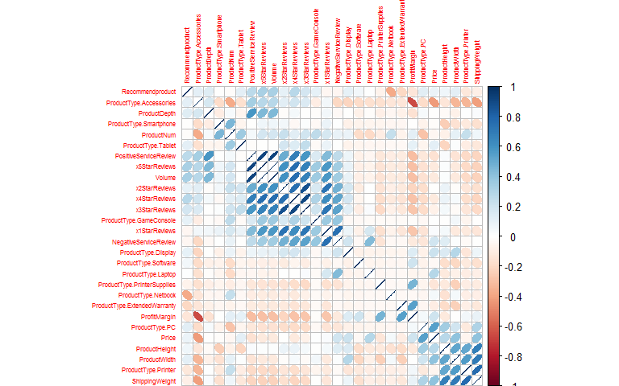
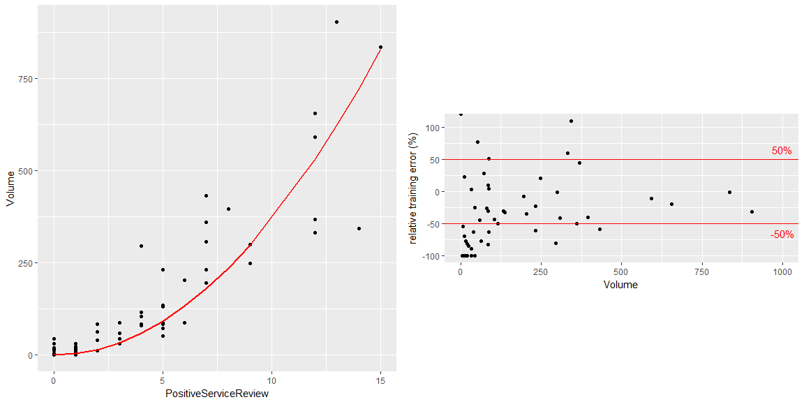

Predict profitability of new products
================
Vera Giulia Sala - Ubiqum Code Academy

------------------------------------------------------------------------

Goal of the analysis
====================

------------------------------------------------------------------------

The sales team of Blackwell Electronics is considering adding some new products to Blackwell's product mix. They have shortlisted 17 that fit Blackwell's business strategy, but now they need help narrowing the list down to five, corresponding to the highest profitable ones. To that end, the goal of the analysis is to build a predictive model, based on the data of the products that are already on the market, that determines the profitabiliy of a product based on a certain number of product attributes. That model will be used to predict the profitability of new products and determine the most rentable one.
The sales team is also interested in how specific product types perform against each other, i.e. if some product types are more likely to have a higher volume of sales (especially among PC, Laptops, Netbooks and Smartphones).

------------------------------------------------------------------------

Dataset
=======

------------------------------------------------------------------------

The "existing products" dataset contains the existing Blackwell product mix, consisting of 80 products. For each product 18 features are recorded:

-   Product ID: 'ProductNum'

-   Product type: 'ProductType'

-   Quality attributes: 'x5StarReviews', 'x4StarReviews', 'x3StarReviews', 'x2StarReviews' 'x1StarReviews', 'PositiveServiceReview', 'NegativeServiceReview', 'Wouldconsumerrecommendproduct', 'BestSellersRank'

-   Physical attributes: 'ShippingWeight', 'ProductDepth', 'ProductWidth', 'ProductHeight'

-   Profit margin: 'Profitmargin'

-   Volume of sales: 'Volume'

The "new products" dataset contains 24 new products, for which we want to predict the volume of sales.

------------------------------------------------------------------------

Preprocessing and exploratory analysis of data
==============================================

------------------------------------------------------------------------

We perform a first exploration of the existing and new products datasets. We check the data quality (missing values, repeated rows), check the distribution of data and remove ouliers.

------------------------------------------------------------------------

First exploration of data
-------------------------

------------------------------------------------------------------------

``` r
library(reshape2)
library(ggplot2)
library(corrplot)
library(caret)
library(dplyr)
library(knitr)
```

``` r
dati_ex <- read.csv("existingproductattributes2017.csv")
dati_new <- read.csv("newproductattributes2017.csv")
```

``` r
str(dati_ex)
```

    ## 'data.frame':    80 obs. of  18 variables:
    ##  $ ProductType          : Factor w/ 12 levels "Accessories",..: 7 7 7 5 5 1 1 1 1 1 ...
    ##  $ ProductNum           : int  101 102 103 104 105 106 107 108 109 110 ...
    ##  $ Price                : num  949 2250 399 410 1080 ...
    ##  $ x5StarReviews        : int  3 2 3 49 58 83 11 33 16 10 ...
    ##  $ x4StarReviews        : int  3 1 0 19 31 30 3 19 9 1 ...
    ##  $ x3StarReviews        : int  2 0 0 8 11 10 0 12 2 1 ...
    ##  $ x2StarReviews        : int  0 0 0 3 7 9 0 5 0 0 ...
    ##  $ x1StarReviews        : int  0 0 0 9 36 40 1 9 2 0 ...
    ##  $ PositiveServiceReview: int  2 1 1 7 7 12 3 5 2 2 ...
    ##  $ NegativeServiceReview: int  0 0 0 8 20 5 0 3 1 0 ...
    ##  $ Recommendproduct     : num  0.9 0.9 0.9 0.8 0.7 0.3 0.9 0.7 0.8 0.9 ...
    ##  $ BestSellersRank      : int  1967 4806 12076 109 268 64 NA 2 NA 18 ...
    ##  $ ShippingWeight       : num  25.8 50 17.4 5.7 7 1.6 7.3 12 1.8 0.75 ...
    ##  $ ProductDepth         : num  23.9 35 10.5 15 12.9 ...
    ##  $ ProductWidth         : num  6.62 31.75 8.3 9.9 0.3 ...
    ##  $ ProductHeight        : num  16.9 19 10.2 1.3 8.9 ...
    ##  $ ProfitMargin         : num  0.15 0.25 0.08 0.08 0.09 0.05 0.05 0.05 0.05 0.05 ...
    ##  $ Volume               : int  12 8 12 196 232 332 44 132 64 40 ...

``` r
a <- as.data.frame(table(dati_ex$ProductType))
b <- as.data.frame(table(dati_new$ProductType))
ggplot(a,aes(x=Var1,y=Freq))+geom_col(fill="gray")+geom_col(data=b,aes(x=Var1,y=Freq),fill="red",alpha=0.5)+ theme(axis.text.x=element_text(angle=60,hjust=1)) + xlab("")+
geom_rect(xmin=8, xmax=8.3, ymin=20, ymax=21, color="red",fill="red",alpha=0.5)+
geom_rect(xmin=8, xmax=8.3, ymin=18, ymax=19, color="gray",fill="gray",alpha=0.5)+
annotate("text", x = 9.5, y = 20.6, label = "New products")+
annotate("text", x = 9.5, y = 18.6, label = "Ex. products")
```


------------------------------------------------------------------------

Missing values: remove BestSellersRank attribute
------------------------------------------------

------------------------------------------------------------------------

``` r
print(paste("The number of NAs in the existing dataset is ", (sum(is.na(dati_ex)))))
```

    ## [1] "The number of NAs in the existing dataset is  15"

``` r
print(paste("NAs from the BestSellerRank attribute", (sum(is.na(dati_ex$BestSellersRank)))))
```

    ## [1] "NAs from the BestSellerRank attribute 15"

``` r
dati_ex <- dati_ex[colnames(dati_ex) != "BestSellersRank"]
dati_new <- dati_new[colnames(dati_new) != "BestSellersRank"]
```

------------------------------------------------------------------------

Outliers
--------

------------------------------------------------------------------------

We use histograms and scatter plots to identify and remove outliers.

``` r
options(repr.plot.width=15, repr.plot.height=3)
p1 <- ggplot(dati_ex,aes(x=Volume))+ geom_histogram()
p2 <- ggplot(dati_ex, aes(x=x4StarReviews, y=Volume))+geom_smooth(method='lm',formula=y~x, col="red")+ geom_point()+           geom_point(data=dati_ex[which(dati_ex$Volume > 6000),],col="blue",size=3)+ geom_point(data=dati_ex[which(dati_ex$Volume < 6000 & dati_ex$x2StarReviews > 40),],col="blue",size=3)+ggtitle("With outliers")
p3 <- ggplot(dati_ex[which(dati_ex$Volume < 6000 & dati_ex$x2StarReviews < 40),], aes(x=x4StarReviews, y=Volume))+geom_smooth(method='lm',formula=y~x, col="red")+ geom_point()+ggtitle("Outliers removed")
multiplot(p1, p2, p3, cols=3)
```


``` r
outliers <- dati_ex[which(dati_ex$Volume > 6000 | dati_ex$x2StarReviews > 40 | dati_ex$NegativeServiceReview > 40 | dati_ex$PositiveServiceReview >200),]
```

``` r
dati_ex <- dati_ex[which(dati_ex$Volume < 6000 & dati_ex$x2StarReviews < 40 & dati_ex$NegativeServiceReview < 40 & dati_ex$PositiveServiceReview <200),]
```

``` r
dim(dati_ex)
```

    ## [1] 65 17

------------------------------------------------------------------------

Attributes type: categorical to dummy variables
-----------------------------------------------

------------------------------------------------------------------------

``` r
newDataframe <- dummyVars(" ~ .", data = dati_ex)
dati_ex_d <- data.frame(predict(newDataframe, newdata = dati_ex))
```

------------------------------------------------------------------------

Feature Selection
=================

------------------------------------------------------------------------

We use feature selection to determine the set of variables that are more relevant for volume prediction. This process follows three steps:

-   elimination of "bad" features
-   elimination of collinear features
-   feature selection using random forest prediction (feature importance)

------------------------------------------------------------------------

Removing "bad" features: x5StarReviews
--------------------------------------

------------------------------------------------------------------------

From the features correlation matrix, we find that "x5StarReviews" is 100% correlated with the volume (the dependent variable we are trying to predict). The explicit linear relation is shown in the linear model below. We deduce that there has been an error in the data recollection. We eliminate the "x5StarReviews" variable.

``` r
options(repr.plot.width=10, repr.plot.height=10)
M <- cor(dati_ex_d[!(names(dati_ex_d) %in% c("ProductType"))])
corrplot(M, method="ellipse",order="hclust",tl.cex=0.5)
```



``` r
linmod5 <- lm(Volume ~ x5StarReviews, dati_ex_d)
```

``` r
linmod5 <- lm(Volume ~ x5StarReviews, dati_ex_d)
ggplot(dati_ex_d, aes(x=x5StarReviews, y=Volume))+geom_smooth(method='lm',formula=y~x, col="red")+ geom_point()+
annotate("text", x = 150, y = 1700, label = "Volume = 4 * x5StarReviews", col='black')
```


``` r
dati_ex_d <- dati_ex_d[colnames(dati_ex_d) != "x5StarReviews"]
```

------------------------------------------------------------------------

Remove collinear features
-------------------------

------------------------------------------------------------------------

We remove independent variables that are highly collinear, i.e. having a high correlation coefficient. Specifically, "x3StarReviews" is highly correlated with "x4StarReviews". We remove "x3StarReviews", being the variable with the lowest correlation with the dependent variable (Volume).

``` r
M <- cor(dati_ex[!(names(dati_ex) %in% c("ProductType","ProductNum","x5StarReviews"))])
corrplot(M, method="number",order="hclust",tl.cex=0.5,number.cex=0.7)
```


``` r
dati_ex_d <- dati_ex_d[colnames(dati_ex_d) != "x3StarReviews"]
```

------------------------------------------------------------------------

Feature selection with random forest
------------------------------------

------------------------------------------------------------------------

We train a random forest model on the full dataset (all features included). From the variables importance given as an output from the model, we determine the most relevant features.

> just two variables are relevant: x4StarReviews, PositiveServiceReview

``` r
t <- proc.time() 
set.seed(400)
ctrl <- trainControl(method="cv",number=3, repeats = 3) 
modrf <- train(Volume ~ ., dati_ex_d[names(dati_ex_d) != "ProductNum"], method = "rf", trControl = ctrl, tuneLength =10) 
proc.time()-t
```

``` r
print(modrf)
```

    ## Random Forest 
    ## 
    ## 65 samples
    ## 24 predictors
    ## 
    ## No pre-processing
    ## Resampling: Cross-Validated (3 fold) 
    ## Summary of sample sizes: 44, 44, 42 
    ## Resampling results across tuning parameters:
    ## 
    ##   mtry  RMSE      Rsquared 
    ##    2    292.1074  0.7989546
    ##    4    247.0589  0.8390187
    ##    6    229.4458  0.8635939
    ##    9    211.5507  0.8747538
    ##   11    200.5826  0.8858079
    ##   14    189.9035  0.8901191
    ##   16    184.0814  0.8919258
    ##   19    171.9224  0.8928755
    ##   21    165.8687  0.8954004
    ##   24    161.0419  0.8904398
    ## 
    ## RMSE was used to select the optimal model using  the smallest value.
    ## The final value used for the model was mtry = 24.

``` r
varImpPlot(modrf$finalModel, main="Variables Importance")
```


> From our analysis we see that we can use just two variables (x4StarReviews, PositiveServiceReview) for volume prediction. The product type seems irrelevant for the prediction.

------------------------------------------------------------------------

Volume predictions: study of how different models predict
=========================================================

------------------------------------------------------------------------

We train different models using just the two features selected before (x4StarReviews, PositiveServiceReview). We use 3-fold cross-validation (repeated x3) on the full existing products dataset. For each model we plot the predicted values and compare it with the real values. We plot the relative prediction error.

> **Random forest**

``` r
t <- proc.time() 
set.seed(400)
ctrl <- trainControl(method="cv",number=3, repeats = 3) 
modrf_2 <- train(Volume ~ x4StarReviews + PositiveServiceReview, dati_ex_d, method = "rf", trControl = ctrl, tuneLength =10) 
proc.time()-t
```

``` r
print(modrf_2)
```

    ## Random Forest 
    ## 
    ## 65 samples
    ##  2 predictor
    ## 
    ## No pre-processing
    ## Resampling: Cross-Validated (3 fold) 
    ## Summary of sample sizes: 44, 44, 42 
    ## Resampling results:
    ## 
    ##   RMSE      Rsquared
    ##   149.2552  0.89969 
    ## 
    ## Tuning parameter 'mtry' was held constant at a value of 2

``` r
grid <- expand.grid(x=-50:150, y=-100:130)
names(grid) <- c("x4StarReviews","PositiveServiceReview")
w <- predict(modrf_2,grid)
grid$pred <- w
```

``` r
a1 <- ggplot(grid, aes(x4StarReviews, PositiveServiceReview)) + geom_tile(aes(fill = pred)) +
  xlab("4 Star Reviews") + ylab("Positive Service Review") +
  scale_fill_gradientn(name="Volume Prediction",limits = c(0, 1800),colours = terrain.colors(10))+
  scale_x_continuous(expand = c(0,0)) +
  scale_y_continuous(expand = c(0,0))+geom_point(data=dati_ex_d,aes(x=x4StarReviews,y=PositiveServiceReview,col=Volume),size=3)+
  scale_color_gradientn(limits = c(0, 1800),colours = terrain.colors(10))+
  geom_point(data=dati_ex_d,aes(x=x4StarReviews,y=PositiveServiceReview),shape=21,size=3,stroke=0.5,col="black",alpha=0.2)+
  annotate("text", x = 20, y = 120, label ='atop(bold("random forest, R2=0.90, RMSE=149"))', parse = TRUE)
```

``` r
abc <- (predict(modrf_2,dati_ex_d) - dati_ex_d$Volume)/dati_ex_d$Volume*100
a2 <- ggplot(dati_ex_d,aes(x=Volume, y=abc))+geom_point()+ylab("relative training error (%)")+geom_hline(yintercept = 50, col='red')+
geom_hline(yintercept = -50, col='red')+annotate("text", x = 1000, y = 65, label = "50%", col='red')+ annotate("text", x = 1000, y = -65, label = "-50%", col='red')+coord_fixed(ratio = 3)
```

``` r
multiplot(a1,a2, cols = 2)
```


``` r
pred <- as.data.frame(dati_ex_d$Volume)
names(pred) <- "Volume"
pred$pred_vol <- predict(modrf_2,dati_ex_d)
pred$err_rel <- (predict(modrf_2,dati_ex_d) - dati_ex_d$Volume)/dati_ex_d$Volume*100
pred[pred$err_rel > 80,]
```

    ##    Volume  pred_vol  err_rel
    ## 1      12 35.736133 197.8011
    ## 26      0 13.995392      Inf
    ## 29      0  5.789302      Inf
    ## 53      0  5.789302      Inf
    ## 56      4 12.742933 218.5733

> **k-nn**

``` r
t <- proc.time() 
set.seed(400)
ctrl <- trainControl(method="cv",number=3, repeats = 3) 
modknn_2 <- train(Volume ~ x4StarReviews + PositiveServiceReview, dati_ex_d, method = "knn", trControl = ctrl, tuneLength =10) 
proc.time()-t
```

``` r
print(modknn_2)
```

    ## k-Nearest Neighbors 
    ## 
    ## 65 samples
    ##  2 predictor
    ## 
    ## No pre-processing
    ## Resampling: Cross-Validated (3 fold) 
    ## Summary of sample sizes: 44, 44, 42 
    ## Resampling results across tuning parameters:
    ## 
    ##   k   RMSE      Rsquared 
    ##    5  212.0459  0.8844291
    ##    7  224.2188  0.8758026
    ##    9  254.3254  0.8400348
    ##   11  273.7833  0.8342196
    ##   13  292.2276  0.8261634
    ##   15  309.5945  0.8061713
    ##   17  325.2867  0.7806268
    ##   19  335.0233  0.7825385
    ##   21  351.6957  0.7708678
    ##   23  364.1113  0.7763524
    ## 
    ## RMSE was used to select the optimal model using  the smallest value.
    ## The final value used for the model was k = 5.


> **Linear model**

``` r
t <- proc.time() 
set.seed(400)
ctrl <- trainControl(method="cv",number=3, repeats = 3) 
modlm_2 <- train(Volume ~ x4StarReviews + PositiveServiceReview, dati_ex_d, method = "lm", trControl = ctrl, tuneLength =10) 
proc.time()-t
```

``` r
print(modlm_2)
```

    ## Linear Regression 
    ## 
    ## 65 samples
    ##  2 predictor
    ## 
    ## No pre-processing
    ## Resampling: Cross-Validated (3 fold) 
    ## Summary of sample sizes: 44, 44, 42 
    ## Resampling results:
    ## 
    ##   RMSE      Rsquared 
    ##   180.4468  0.8762184
    ## 
    ## Tuning parameter 'intercept' was held constant at a value of TRUE


> **Decision tree M5**

``` r
t <- proc.time() 
set.seed(400)
ctrl <- trainControl(method="cv",number=3, repeats = 3) 
modm5_2 <- train(Volume ~ x4StarReviews + PositiveServiceReview, dati_ex_d, method = "M5", trControl = ctrl, tuneLength =10) 
proc.time()-t
```

``` r
print(modm5_2)
```

    ## Model Tree 
    ## 
    ## 65 samples
    ##  2 predictor
    ## 
    ## No pre-processing
    ## Resampling: Cross-Validated (3 fold) 
    ## Summary of sample sizes: 44, 44, 42 
    ## Resampling results across tuning parameters:
    ## 
    ##   pruned  smoothed  rules  RMSE      Rsquared 
    ##   Yes     Yes       Yes    154.4512  0.8883857
    ##   Yes     Yes       No     165.7957  0.8841872
    ##   Yes     No        Yes    153.1293  0.8889403
    ##   Yes     No        No     153.1293  0.8889403
    ##   No      Yes       Yes    160.6969  0.9022398
    ##   No      Yes       No     160.1112  0.8882459
    ##   No      No        Yes    152.7311  0.8682155
    ##   No      No        No     207.0025  0.7627670
    ## 
    ## RMSE was used to select the optimal model using  the smallest value.
    ## The final values used for the model were pruned = No, smoothed = No
    ##  and rules = Yes.


> **Decision tree rpart **

``` r
t <- proc.time() 
set.seed(400)
ctrl <- trainControl(method="cv",number=3, repeats = 3) 
modrpart_2 <- train(Volume ~ x4StarReviews + PositiveServiceReview, dati_ex_d, method = "rpart", trControl = ctrl, tuneLength =10) 
proc.time()-t
```

``` r
print(modrpart_2)
```

    ## CART 
    ## 
    ## 65 samples
    ##  2 predictor
    ## 
    ## No pre-processing
    ## Resampling: Cross-Validated (3 fold) 
    ## Summary of sample sizes: 44, 44, 42 
    ## Resampling results across tuning parameters:
    ## 
    ##   cp          RMSE      Rsquared 
    ##   0.00000000  218.0303  0.7772027
    ##   0.09196349  248.6155  0.7064437
    ##   0.18392697  255.0902  0.7031245
    ##   0.27589046  255.0902  0.7031245
    ##   0.36785395  255.0902  0.7031245
    ##   0.45981744  255.0902  0.7031245
    ##   0.55178092  255.0902  0.7031245
    ##   0.64374441  255.0902  0.7031245
    ##   0.73570790  482.6239  0.2690004
    ##   0.82767139  482.6239  0.2690004
    ## 
    ## RMSE was used to select the optimal model using  the smallest value.
    ## The final value used for the model was cp = 0.


> **Support Vector Machine (SVM) **

``` r
t <- proc.time() 
set.seed(400)
ctrl <- trainControl(method="cv",number=3, repeats = 3) 
modsvm_2 <- train(Volume ~ x4StarReviews + PositiveServiceReview, dati_ex_d, method = "svmRadial", trControl = ctrl, tuneLength =10) 
proc.time()-t
```

``` r
print(modsvm_2)
```

    ## Support Vector Machines with Radial Basis Function Kernel 
    ## 
    ## 65 samples
    ##  2 predictor
    ## 
    ## No pre-processing
    ## Resampling: Cross-Validated (3 fold) 
    ## Summary of sample sizes: 44, 44, 42 
    ## Resampling results across tuning parameters:
    ## 
    ##   C       RMSE      Rsquared 
    ##     0.25  377.0583  0.6777457
    ##     0.50  336.7179  0.7437109
    ##     1.00  289.1865  0.7948795
    ##     2.00  263.2763  0.8203476
    ##     4.00  264.3774  0.8198803
    ##     8.00  264.7004  0.8200406
    ##    16.00  264.7004  0.8200406
    ##    32.00  264.7004  0.8200406
    ##    64.00  264.7004  0.8200406
    ##   128.00  264.7004  0.8200406
    ## 
    ## Tuning parameter 'sigma' was held constant at a value of 6.601003
    ## RMSE was used to select the optimal model using  the smallest value.
    ## The final values used for the model were sigma = 6.601003 and C = 2.


> **Gradient Boosting Machine (gbm)**

``` r
t <- proc.time() 
set.seed(400)
ctrl <- trainControl(method="cv",number=3, repeats = 3) 
modgbm_2 <- train(Volume ~ x4StarReviews + PositiveServiceReview, dati_ex_d, method = "gbm", trControl = ctrl, tuneLength =10) 
proc.time()-t
```


------------------------------------------------------------------------

Predictive models: train - test
-------------------------------

------------------------------------------------------------------------

We train and evaluate the same models trained before using a train- test splitting of the data. This is done just as a check for what we found before.

``` r
set.seed(902)
train_index <- createDataPartition(dati_ex_d$Volume,p=0.7, list=FALSE, times =1)
train <- dati_ex_d[train_index,c("Volume","PositiveServiceReview","x4StarReviews")]
test <- dati_ex_d[-train_index,c("Volume","PositiveServiceReview","x4StarReviews")]
```

``` r
set.seed(400)
ctrl <- trainControl(method="none") 
m_rf <- train(Volume ~ ., train, method = "rf", trControl = ctrl, tuneLength =1,tuneGrid = data.frame(.mtry = 2))
m_knn <- train(Volume ~ ., train, method = "knn", trControl = ctrl, tuneLength =1,tuneGrid = data.frame(.k = 5))
m_lm <- train(Volume ~ ., train, method = "lm", trControl = ctrl, tuneLength =1,tuneGrid = data.frame(.intercept=TRUE))
m_m5 <- train(Volume ~ ., train, method = "M5", trControl = ctrl, tuneLength =1,tuneGrid = data.frame(.pruned = 'Yes', .smoothed = 'No', .rules = 'Yes'))
m_rpart <- train(Volume ~ ., train, method = "rpart", trControl = ctrl, tuneLength =1,tuneGrid = data.frame(.cp = 0))
m_svm <- train(Volume ~ ., train, method = "svmRadial", trControl = ctrl, tuneLength =1,tuneGrid = data.frame(.sigma = 6.827171, .C = 2))
m_gbm <- train(Volume ~ ., train, method = "gbm", trControl = ctrl, tuneLength =1,tuneGrid = data.frame(.n.trees = 500, .interaction.depth = 6, .shrinkage = 0.1, .n.minobsinnode = 10.))
```

``` r
test$rf <- predict(m_rf,test)
test$knn <- predict(m_knn,test)
test$lm <- predict(m_lm,test)
test$m5 <- predict(m_m5,test)
test$rpart <- predict(m_rpart,test)
test$svm <- predict(m_svm,test)
test$gbm <- predict(m_gbm,test)
```

``` r
rel_err <- (test[,4:10] - test[,"Volume"])/test[,"Volume"]*100
rel_err$Volume <- test$Volume
```

``` r
ddd <- melt(rel_err, id.vars="Volume")
p1 <- ggplot(ddd, aes(x=Volume,y=value, col=variable))+ geom_point()+geom_line(size=1)+ylab("relative error %")+scale_color_discrete(name="model")
p2 <- ggplot(ddd[!(ddd$variable %in% c("svm","gbm","rpart")),], aes(x=Volume,y=value, col=variable))+ geom_point(size=4)+geom_line(size=0.5)+geom_hline(yintercept=50)+geom_hline(yintercept=-50)+geom_hline(yintercept=0,col="red",size=1, linetype="dotted")+ylab("relative error %")+scale_color_discrete(name="model")+ annotate("text", x = 1000, y = 65, label = "50%")+ annotate("text", x = 1000, y = -65, label = "-50%")
multiplot(p1, p2, cols=2)
```


------------------------------------------------------------------------

Predictions with reduced variable range: zone2
----------------------------------------------

------------------------------------------------------------------------

We try to improve the accuracy of predictions, reducing the range for independent variables (zone2).

> We realize that, while the RMSE is reduced (reasonably, since we are reducing the range of volumes), the relative error is not substantially improving.

``` r
pp1 <- ggplot(data=dati_ex,aes(x=x4StarReviews,y=PositiveServiceReview,col=Volume))+geom_point(size=2) +
  scale_colour_gradientn(colours = terrain.colors(10))+ geom_hline(yintercept = 20, size=0.5)+
  annotate("text", x = 70, y = 70, label = 'atop(bold("ZONE1"))', parse = TRUE)+annotate("text", x = 70, y = 0, label = 'atop(bold("ZONE2"))', parse = TRUE)
pp2 <- ggplot(data= outliers,aes(x=x4StarReviews,y=PositiveServiceReview))+geom_point(size=2) +
geom_point(data=dati_ex,aes(x=x4StarReviews,y=PositiveServiceReview,col=Volume),size=2)+
  scale_colour_gradientn(colours = terrain.colors(10))+annotate("text", x = 100, y = 510, label = 'atop(bold("OUTLIERS"))', parse = TRUE)
multiplot(pp2,pp1, cols = 2)
```


``` r
outliers[outliers$ProductType != "ExtendedWarranty",c("ProductNum","Price","x4StarReviews","PositiveServiceReview","Volume")]
```

    ##    ProductNum  Price x4StarReviews PositiveServiceReview Volume
    ## 18        118 174.99           100                   310    680
    ## 22        122 124.99           187                    55   1576
    ## 23        123  56.99           217                   144   2052
    ## 48        148  10.75           261                   120   2140
    ## 50        150  49.99           431                   536  11204
    ## 67        167 149.99            89                    42    824
    ## 73        198 129.00           296                    56   7036

``` r
dati_red <- dati_ex_d[which(dati_ex_d$PositiveServiceReview < 20  ),]
```

``` r
dim(dati_red)
```

    ## [1] 57 26

``` r
q1 <- ggplot(dati_red,aes(x=x4StarReviews,y=PositiveServiceReview, col=Volume))+geom_point(size=3)+
        scale_colour_gradientn(colours = terrain.colors(10))
```


------------------------------------------------------------------------

Predictions with just one independent variable: PositiveServiceReview
---------------------------------------------------------------------

------------------------------------------------------------------------

We can predict zone2 with more or less the same accuracy using just one independent variable: PositiveServiceReview.

``` r
mmm <-  lm(Volume ~  0 + I(PositiveServiceReview^2) , dati_ex_d[dati_ex_d$PositiveServiceReview < 20 & dati_ex_d$PositiveServiceReview > 0,])
summary(mmm)
```



------------------------------------------------------------------------

New products volume predictions
===============================

------------------------------------------------------------------------

> We chose as best model, the random forest trained on the full variable space (x4StarReviews, PositiveServiceReview). We use this model to predict the volume of sales for the new products.

``` r
dati_new$Volume <-  predict(modrf_2,dati_new[c("x4StarReviews","PositiveServiceReview","Volume")])
```

``` r
yyy <- dati_new[c("ProductType","ProductNum","Price","x4StarReviews","PositiveServiceReview","ProfitMargin","Volume")]
yyy$TotProfit <- round(yyy$Volume*yyy$ProfitMargin*yyy$Price,0)
yyy$Volume <- round(yyy$Volume,0)
kable(yyy[order(-yyy$TotProfit),])
```

|     | ProductType      |  ProductNum|    Price|  x4StarReviews|  PositiveServiceReview|  ProfitMargin|  Volume|  TotProfit|
|-----|:-----------------|-----------:|--------:|--------------:|----------------------:|-------------:|-------:|----------:|
| 24  | GameConsole      |         307|   425.00|            252|                     59|          0.18|    1385|     105977|
| 10  | Tablet           |         186|   629.00|             66|                     28|          0.10|    1440|      90585|
| 1   | PC               |         171|   699.00|             26|                     12|          0.25|     387|      67650|
| 11  | Tablet           |         187|   199.00|            437|                     90|          0.20|    1629|      64835|
| 7   | Netbook          |         180|   329.00|            112|                     28|          0.09|    1406|      41630|
| 16  | GameConsole      |         199|   249.99|             97|                     32|          0.09|    1486|      33440|
| 2   | PC               |         172|   860.00|             11|                      7|          0.20|     129|      22139|
| 3   | Laptop           |         173|  1199.00|             10|                     11|          0.10|     155|      18634|
| 21  | Printer          |         304|   199.99|              8|                      5|          0.90|      81|      14522|
| 4   | Laptop           |         175|  1199.00|              2|                      2|          0.15|      53|       9501|
| 12  | Smartphone       |         193|   199.00|             26|                      8|          0.11|     297|       6506|
| 8   | Netbook          |         181|   439.00|             18|                      5|          0.11|     115|       5569|
| 15  | Smartphone       |         196|   300.00|             19|                      5|          0.11|     142|       4688|
| 13  | Smartphone       |         194|    49.00|             26|                     14|          0.12|     555|       3261|
| 5   | Laptop           |         176|  1999.00|              1|                      0|          0.23|       6|       2662|
| 14  | Smartphone       |         195|   149.00|              8|                      4|          0.15|      80|       1798|
| 6   | Netbook          |         178|   399.99|              8|                      2|          0.08|      51|       1641|
| 20  | Software         |         303|    70.99|             18|                      4|          0.20|     115|       1634|
| 9   | Netbook          |         183|   330.00|              4|                      1|          0.09|      30|        883|
| 23  | ExtendedWarranty |         306|    99.99|              1|                      0|          0.40|       6|        232|
| 17  | Display          |         201|   140.00|              0|                      1|          0.05|      14|         98|
| 22  | PrinterSupplies  |         305|    20.99|              0|                      1|          0.30|      14|         88|
| 19  | Accessories      |         302|     8.50|              2|                      2|          0.10|      53|         45|
| 18  | Accessories      |         301|    20.99|              1|                      2|          0.05|      34|         36|

``` r
ggplot(data=dati_ex,aes(x=x4StarReviews,y=PositiveServiceReview,col=Volume))+geom_point(size=3)+
geom_point(data=dati_new, aes(x=x4StarReviews,y=PositiveServiceReview,fill=Volume),shape=23,col="black", size=5)+
 scale_colour_gradientn(colours = terrain.colors(10), limits = c(0, 2000))+
scale_fill_gradientn(limits = c(0, 2000), colours = terrain.colors(10))+ggtitle("Comparison new (rhombus) - existing products")+
annotate("text", x = 220, y = 67, label = "gameconsole-307", col='black')+
annotate("text", x = 45, y = 35, label = "tablet-186", col='black')+
annotate("text", x = 50, y = 10, label = "PC-171", col='black')+
annotate("text", x = 390, y = 90, label = "tablet-187", col='black')+
annotate("text", x = 165, y = 27, label = "netbook-180", col='black')
```


``` r
ggplot(data=dati_ex,aes(x=x4StarReviews,y=PositiveServiceReview,col=Volume))+geom_point(size=3)+
geom_point(data=dati_new, aes(x=x4StarReviews,y=PositiveServiceReview,fill=Volume),shape=23,col="black", size=5)+
 scale_colour_gradientn(colours = terrain.colors(10), limits = c(0, 2500))+
scale_fill_gradientn(limits = c(0, 2500), colours = terrain.colors(10))+ggtitle("Comparison new (rhombus) - existing products (outliers: triangles)")+ 
geom_point(data= outliers,aes(x=x4StarReviews,y=PositiveServiceReview, col=Volume),shape=17, size=3)+
annotate("text", x = 340, y = 50, label ="Vol=7036", col='black') +
annotate("text", x = 400, y = 510, label ="Vol=11204", col='black')
```


------------------------------------------------------------------------

Predictions for the categories: "Laptop","PC","Netbook","Smartphone"
--------------------------------------------------------------------

------------------------------------------------------------------------

``` r
nnn<- dati_new[dati_new$ProductType %in% c("Laptop","PC","Netbook","Smartphone"),c("ProductType","ProductNum","Price","x4StarReviews","PositiveServiceReview","ProfitMargin","Volume")]
nnn$TotProfit <- round(nnn$Volume*nnn$ProfitMargin*nnn$Price,0)
nnn$Volume <- round(nnn$Volume,0)
kable(nnn[order(-nnn$TotProfit),])
```

|     | ProductType |  ProductNum|    Price|  x4StarReviews|  PositiveServiceReview|  ProfitMargin|  Volume|  TotProfit|
|-----|:------------|-----------:|--------:|--------------:|----------------------:|-------------:|-------:|----------:|
| 1   | PC          |         171|   699.00|             26|                     12|          0.25|     387|      67650|
| 7   | Netbook     |         180|   329.00|            112|                     28|          0.09|    1406|      41630|
| 2   | PC          |         172|   860.00|             11|                      7|          0.20|     129|      22139|
| 3   | Laptop      |         173|  1199.00|             10|                     11|          0.10|     155|      18634|
| 4   | Laptop      |         175|  1199.00|              2|                      2|          0.15|      53|       9501|
| 12  | Smartphone  |         193|   199.00|             26|                      8|          0.11|     297|       6506|
| 8   | Netbook     |         181|   439.00|             18|                      5|          0.11|     115|       5569|
| 15  | Smartphone  |         196|   300.00|             19|                      5|          0.11|     142|       4688|
| 13  | Smartphone  |         194|    49.00|             26|                     14|          0.12|     555|       3261|
| 5   | Laptop      |         176|  1999.00|              1|                      0|          0.23|       6|       2662|
| 14  | Smartphone  |         195|   149.00|              8|                      4|          0.15|      80|       1798|
| 6   | Netbook     |         178|   399.99|              8|                      2|          0.08|      51|       1641|
| 9   | Netbook     |         183|   330.00|              4|                      1|          0.09|      30|        883|

``` r
 ggplot(data=dati_ex[dati_ex$PositiveServiceReview < 20, ],aes(x=x4StarReviews,y=PositiveServiceReview,col=Volume))+geom_point(size=3) +xlim(0,120)+ geom_point(data=dati_new[dati_new$ProductType %in% c("Laptop","Netbook","Smartphone","PC","Volume") & dati_new$PositiveServiceReview < 20,], aes(x=x4StarReviews,y=PositiveServiceReview,fill=Volume),shape=23,col="black", size=5)+
 scale_colour_gradientn(colours = terrain.colors(10), limits = c(0, 1000))+  scale_fill_gradientn(colours = terrain.colors(10),limits = c(0, 1000))+ggtitle("Comparison new (rhombus) - existing products")+
annotate("text", x = 36, y = 11.5, label = "pc-171", col='black')+
annotate("text", x = 10, y = 8, label = "pc-172", col='black')+
annotate("text", x = 11, y = 10, label = "laptop-173", col='black')+
annotate("text", x = 4, y = 3, label = "laptop-175", col='black')
```


------------------------------------------------------------------------

Conclusions
===========

------------------------------------------------------------------------

> From our analysis it seems that there is no clear relationship between the product type and the volume of sales.

> The volume of sales seems to be dependent just on two variables: "4StarReviews", "PositiveServiceReview" that characterize the product. Among them, the "PositiveServiceReview" is the most relevant one.

> Using our analysis, we can recommend the 5 most profitable new products, that we think should be added to the Blackwell's product mix:

|     | ProductType |  ProductNum|  Price|  x4StarReviews|  PositiveServiceReview|  ProfitMargin|  Volume|  TotProfit|
|-----|:------------|-----------:|------:|--------------:|----------------------:|-------------:|-------:|----------:|
| 24  | GameConsole |         307|    425|            252|                     59|          0.18|    1385|     105977|
| 10  | Tablet      |         186|    629|             66|                     28|          0.10|    1440|      90585|
| 1   | PC          |         171|    699|             26|                     12|          0.25|     387|      67650|
| 11  | Tablet      |         187|    199|            437|                     90|          0.20|    1629|      64835|
| 7   | Netbook     |         180|    329|            112|                     28|          0.09|    1406|      41630|

> Among the products "Laptop","PC","Netbook","Smartphone", we can recommend the 5 most profitable new products, that we think should be added to the Blackwell's product mix:

|     | ProductType |  ProductNum|  Price|  x4StarReviews|  PositiveServiceReview|  ProfitMargin|  Volume|  TotProfit|
|-----|:------------|-----------:|------:|--------------:|----------------------:|-------------:|-------:|----------:|
| 1   | PC          |         171|    699|             26|                     12|          0.25|     387|      67650|
| 7   | Netbook     |         180|    329|            112|                     28|          0.09|    1406|      41630|
| 2   | PC          |         172|    860|             11|                      7|          0.20|     129|      22139|
| 3   | Laptop      |         173|   1199|             10|                     11|          0.10|     155|      18634|
| 4   | Laptop      |         175|   1199|              2|                      2|          0.15|      53|       9501|

> We remark that our recommandations are not taking into account the possible competition between items of the same category, once we put them on the market. This issue should be taken into account.
